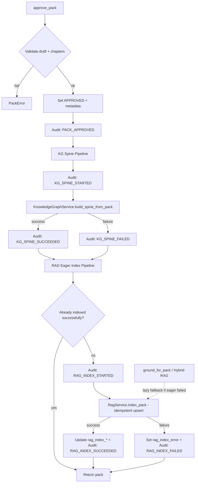

# P3 Implementation Report — Approve Pipeline Extension

> **Phase:** P3 — Pipeline Integration  
> **Status:** ✅ Complete — **awaiting Product Owner approval before P4**  
> **Date:** 2026-07-20  
> **Canonical repository:** `D:\Projects\studynexs-platform\studynexs-dev`  
> **Branch:** `develop`  
> **Alembic head:** `f4a5b6c7d8e9`

---

## 1. Pre-implementation verification

| Check | Result |
|-------|--------|
| Working directory | `D:\Projects\studynexs-platform\studynexs-dev` |
| Git branch | `develop` |
| `alembic current` | `f4a5b6c7d8e9` |
| `alembic heads` | `f4a5b6c7d8e9` (single head) |
| Docker API bind-mount | `studynexs-dev\apps\api` → `/app` |

---

## 2. Files modified

| File | Change |
|------|--------|
| `apps/api/app/modules/curriculum/services/pack_service.py` | Extended `approve_pack()` orchestration; added `_build_kg_spine_with_audit`, `_eager_rag_index_with_audit`, `retry_rag_index`; optional `rag` constructor injection for tests |
| `apps/api/app/modules/curriculum/services/pack_audit.py` | Added audit event types: `KG_SPINE_*`, `RAG_INDEX_STARTED` |
| `apps/api/app/modules/ai/rag/service.py` | **Additive only:** `count_topic_vectors()` helper for observability/tests (no retrieval logic change) |

---

## 3. New files

| File | Purpose |
|------|---------|
| `apps/api/tests/test_batch1_approve_pipeline.py` | P3 test suite (9 tests) |
| `P3_IMPLEMENTATION_REPORT.md` | This report |

---

## 4. Architecture diagram



**Separation of concerns:**

- **Knowledge Graph** — concept spine from pack hierarchy (unchanged service)
- **RagService.index_pack** — eager indexing on approve (unchanged indexing logic)
- **assessment_grounding.ground_for_pack** — lazy self-heal remains fallback (unchanged)
- **curriculum_grounding.ground_approved_pack** — facade unchanged; not wired to QP/LP (P4)

---

## 5. Approval pipeline sequence

```
approve_pack(school_id, pack_id, approved_by)
  1. Validate pack exists, tenant-scoped
  2. Reject if already APPROVED (idempotent guard — no duplicate audits/vectors)
  3. Require ≥1 chapter
  4. Set status=APPROVED, approved_by, approved_at; flush
  5. Append audit: pack_approved
  6. _build_kg_spine_with_audit()
       - audit: kg_spine_started
       - KnowledgeGraphService.build_spine_from_pack()
       - audit: kg_spine_succeeded | kg_spine_failed (failure isolated)
  7. _eager_rag_index_with_audit()
       - skip if rag_indexed_at set and rag_index_error is null
       - audit: rag_index_started
       - RagService.index_pack() (idempotent)
       - update rag_indexed_at, rag_index_topic_count, rag_index_error
       - audit: rag_index_succeeded | rag_index_failed (failure isolated)
  8. Return pack
```

**Retry path (approved pack, prior RAG failure):**

```
retry_rag_index(school_id, pack_id, actor_id)
  → no-op if already successfully indexed
  → else re-run _eager_rag_index_with_audit()
```

---

## 6. Test summary

**Command:** `pytest tests/test_batch1_approve_pipeline.py tests/test_batch1_*.py tests/test_knowledge_graph.py tests/test_rag.py tests/test_rag_hybrid.py`

**Result:** **34 passed** (2026-07-20)

### P3 tests (`test_batch1_approve_pipeline.py`)

| Test | Requirement |
|------|-------------|
| `test_approve_builds_kg_spine_and_eager_rag` | ✓ KG concepts/edges + RAG vectors + metadata |
| `test_approve_emits_full_audit_trail` | ✓ All pipeline audit events |
| `test_idempotent_approval_rejects_duplicate` | ✓ No duplicate approve/vectors/audits |
| `test_rag_failure_does_not_block_kg_or_approval` | ✓ Failure isolation |
| `test_kg_failure_does_not_block_rag_or_approval` | ✓ Failure isolation |
| `test_retry_rag_index_after_failure` | ✓ Retry after failed indexing |
| `test_lazy_fallback_when_eager_index_failed` | ✓ `ground_for_pack` self-heals |
| `test_approve_cross_tenant_isolation_unchanged` | ✓ Tenant guard |
| `test_approve_via_http_exposes_rag_index_status` | ✓ API metadata |

### Regression suites (unchanged behavior)

| Suite | Result |
|-------|--------|
| `test_batch1_learning_outcomes.py` | ✅ Pass |
| `test_batch1_pack_audit.py` | ✅ Pass |
| `test_batch1_curriculum_grounding.py` | ✅ Pass |
| `test_knowledge_graph.py` | ✅ Pass |
| `test_rag.py` | ✅ Pass |
| `test_rag_hybrid.py` | ✅ Pass |

---

## 7. Remaining risks

| Risk | Severity | Mitigation |
|------|----------|------------|
| Shared Postgres may have schema from prior academix runs | Low (dev) | P1 migrations are idempotent; alembic at head |
| KG failure silent to caller (approval still returns 200) | Medium | Audit events + ops monitoring on `kg_spine_failed` |
| RAG failure silent to caller | Medium | `rag_index_error` on pack + audit; `retry_rag_index` available |
| Learning outcomes not yet indexed in RagService.index_pack | Low | P3 scope is topic vectors; LO RAG indexing deferred |
| No public HTTP endpoint for `retry_rag_index` | Low | Service method exists; API route can be added if ops requires |

---

## 8. Technical debt

1. **`retry_rag_index`** — service-only; no REST endpoint yet (acceptable for P3).
2. **LO vector indexing** — Batch 1 academix indexed LOs separately; studynexs `index_pack` indexes topics only. Grounding still works via topic text; LO-specific retrieval is a future enhancement.
3. **KG + RAG orchestration in `pack_service`** — could move to a dedicated `ApprovePipeline` coordinator in a later refactor (not required for reconciliation).
4. **Audit volume** — full pipeline emits 5–7 events per approve; acceptable for pilot governance.

---

## 9. Protected modules — confirmation

The following were **not modified** (architecture and behavior preserved):

| Component | Status |
|-----------|--------|
| Knowledge Graph (`graph_service.py`, etc.) | ✅ Untouched — called as before |
| Hybrid RAG (`hybrid.py`) | ✅ Untouched |
| `assessment_grounding.py` internals | ✅ Untouched |
| ConceptCard | ✅ Untouched |
| Content Review | ✅ Untouched |
| Teacher Copilot | ✅ Untouched |
| Student Copilot | ✅ Untouched |
| Parent Copilot | ✅ Untouched |
| `question_paper_service.py` | ✅ Untouched |
| `lesson_plan_service.py` | ✅ Untouched |
| Admin UI / Playwright | ✅ Untouched |
| Pilot scripts / Gate 2 docs | ✅ Untouched |

**Not in P3 (deferred to P4+):** Wiring QP/LP through `ground_approved_pack()`.

---

## 10. Review gate

| Role | Action | Status |
|------|--------|--------|
| Engineering | P3 implementation | ✅ Complete |
| Product Owner | Approve P3 | ⏸ Pending |
| Engineering | Begin P4 (UI + facade wiring) | ⛔ Blocked until PO approval |

**Do not proceed to P4 until this report is approved.**
