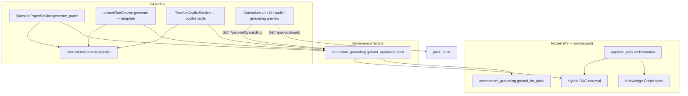

# P4 Implementation Report — Batch 1 UI + Facade Wiring

> **Phase:** P4 — UI + Facade Wiring  
> **Status:** ✅ Complete — **STOP — awaiting Product Owner approval before P5**  
> **Date:** 2026-07-20  
> **Canonical repository:** `D:\Projects\studynexs-platform\studynexs-dev`  
> **Branch:** `develop`  
> **Alembic head:** `f4a5b6c7d8e9`

---

## 1. Pre-implementation verification

| Check | Result |
|-------|--------|
| Working directory | `D:\Projects\studynexs-platform\studynexs-dev` |
| Git branch | `develop` |
| `alembic current` | `f4a5b6c7d8e9` |
| P3 approved architecture | Frozen — no changes to KG, Hybrid RAG, Copilot internals |

---

## 2. Files modified

| File | Change |
|------|--------|
| `apps/api/app/modules/ai/services/question_paper_service.py` | Question paper generation calls `ground_approved_pack()` (facade) instead of direct grounding |
| `apps/api/app/modules/curriculum/services/lesson_plan_service.py` | Template mode uses `ground_approved_pack()` when `pack_id` provided |
| `apps/api/app/modules/curriculum/endpoints/lesson_plan.py` | `generation_mode`: default `template`, optional `copilot`; provenance fields on output |
| `apps/api/app/modules/curriculum/schemas/lesson_plan.py` | Added `generation_mode`, `pack_status`, `pack_version`, `grounded_at` |
| `apps/api/app/modules/ai/schemas/question_paper.py` | Added `pack_status`, `pack_version`, `grounded_at` |
| `apps/api/app/modules/ai/endpoints/ai.py` | `_to_out()` enriches provenance via `provenance_from_sources()` |
| `apps/admin-web/src/app/dashboard/teaching/ai-papers/page.tsx` | `CurriculumGroundingBadge` on generated papers |
| `apps/admin-web/src/app/dashboard/teaching/lesson-plans/page.tsx` | Template + grounding default; Copilot toggle; badge |
| `apps/admin-web/src/app/dashboard/teaching/curriculum/page.tsx` | Extended: LO editor, audit panel, grounding preview (KG/concept panels preserved) |

---

## 3. New files

| File | Purpose |
|------|---------|
| `apps/api/app/modules/curriculum/schemas/provenance.py` | Shared provenance extraction for API/UI |
| `apps/admin-web/src/components/curriculum/CurriculumGroundingBadge.tsx` | Reusable badge: pack, version, approval state, grounded timestamp |
| `apps/api/tests/test_batch1_p4_facade_wiring.py` | P4 facade + endpoint tests (6 tests) |
| `apps/admin-web/scripts/batch1-ui-workflow-demo.cjs` | 11-step Playwright workflow (merged UI selectors) |
| `P4_IMPLEMENTATION_REPORT.md` | This report |

---

## 4. Updated architecture diagram



**Entry points (frozen):**

- `ground_approved_pack()` — single approved curriculum grounding entry for QP + LP template
- `approve_pack()` — orchestration entry (P3)
- Teacher Copilot — optional via `generation_mode: "copilot"` only

---

## 5. UI screenshots

Playwright script writes screenshots to:

`docs/product/batch1-ui-demo/`

| Step | Screenshot (expected) |
|------|------------------------|
| 1 Login | `01-login.png` |
| 2 Create pack | `02-pack-created.png` |
| 3 Add chapter | `03-chapter-added.png` |
| 4 Add topic | `04-topic-added.png` |
| 5 Learning outcome | `05-learning-outcome-added.png` |
| 6 Save draft | `06-draft-saved.png` |
| 7 Edit topic | `07-draft-edited.png` |
| 8 Approve | `08-pack-approved.png` |
| 9 Audit trail | `09-audit-trail.png` |
| 10 Lesson plan badge | `10-lesson-plan-grounded.png` |
| 11 Question paper badge | `11-question-paper-grounded.png` |

**Note:** Screenshots require a live stack (`API :8000`, `admin-web`, LLM/credits for step 11). Run:

```powershell
cd apps/admin-web
$env:E2E_BASE_URL="http://localhost:3005"
node scripts/batch1-ui-workflow-demo.cjs
```

Results JSON: `docs/product/batch1-ui-demo/workflow-results.json`

---

## 6. Playwright results

| Item | Status |
|------|--------|
| Script ported | ✅ `apps/admin-web/scripts/batch1-ui-workflow-demo.cjs` |
| Selectors updated for merged curriculum UI | ✅ |
| Executed in this session | ⏸ Not run — requires live API + admin-web + credentials |
| 11-step workflow preserved | ✅ Same steps; create-pack flow uses merged UI (`New draft pack` → `Save draft pack` → `Add content`) |

---

## 7. Test summary

### API (2026-07-20)

**Command:**

```powershell
cd apps/api
python -m pytest tests/test_batch1_approve_pipeline.py tests/test_batch1_curriculum_grounding.py tests/test_batch1_learning_outcomes.py tests/test_batch1_pack_audit.py tests/test_batch1_p4_facade_wiring.py tests/test_knowledge_graph.py tests/test_curriculum_pack.py -q
```

**Result:** **37 passed**

### P4 tests (`test_batch1_p4_facade_wiring.py`)

| Test | Requirement |
|------|-------------|
| `test_question_paper_uses_ground_approved_pack_facade` | QP via facade |
| `test_lesson_plan_template_mode_via_facade` | LP template + grounding |
| `test_lesson_plan_endpoint_template_mode` | Template mode API + provenance |
| `test_lesson_plan_endpoint_copilot_mode` | Copilot mode API |
| `test_question_paper_api_returns_provenance_for_badge` | QP provenance for badge |
| `test_curriculum_grounding_badge_provenance_helper` | Provenance helper (no duplication) |

### Regressions

| Suite | Result |
|-------|--------|
| `test_batch1_*` (P1–P3) | ✅ Pass |
| `test_knowledge_graph.py` | ✅ Pass |
| `test_curriculum_pack.py` | ✅ Pass |

### Admin-web build

```powershell
cd apps/admin-web
npm run build
```

**Result:** ✅ Compiled successfully (Next.js 16.2.6)

### UI coverage

| Area | Verification |
|------|----------------|
| Grounding badge rendering | Component + API provenance fields; Playwright steps 10–11 when stack up |
| Audit UI | Curriculum page audit panel + existing `test_batch1_pack_audit.py` |
| Learning outcomes UI | Curriculum page LO editor + `test_batch1_learning_outcomes.py` |

---

## 8. Remaining risks

| Risk | Mitigation |
|------|------------|
| Playwright not executed in CI this session | Run script against pilot stack before Gate 2; capture screenshots |
| QP step 11 needs LLM + credits | Demo env must have keys/credits; script accepts dialog for soft-limit |
| Copilot mode consumes AI credits | Toggle clearly labeled; template remains default |
| Merged curriculum page complexity | Batch 1 LO/audit added without removing KG/concept/review panels |
| `grounding preview` only for approved packs | Expected — draft packs cannot call facade |

---

## 9. Protected-module confirmation

| Module / area | Modified? |
|---------------|-----------|
| `knowledge_graph/**` internals | ❌ No |
| `ai/rag/hybrid.py` | ❌ No |
| `assessment_grounding.py` internals | ❌ No (called only via facade) |
| Copilot architecture / `TeacherCopilotService` internals | ❌ No (endpoint routing only) |
| Content Review internals | ❌ No |
| ConceptCard internals | ❌ No |
| Approval / grounding redesign | ❌ No |
| New AI pipelines | ❌ No |

**Additive only:**

- `provenance.py`, badge component, UI panels, provenance API fields
- `count_topic_vectors()` (P3) unchanged in P4

---

## 10. Review gate

**P4 is complete. Do not begin P5** (validation, smoke, seeds, Gate 2) until Product Owner approves this report.

**Deliverables checklist:**

- [x] QP via `ground_approved_pack()`
- [x] LP template + optional Copilot toggle
- [x] `CurriculumGroundingBadge` (pack, version, approval, timestamp)
- [x] Curriculum UI: LO editor, audit, grounding preview
- [x] Additive API provenance fields
- [x] Playwright script updated for merged UI
- [x] Tests + build validation
- [x] Protected modules untouched

**Awaiting Product Owner approval.**
