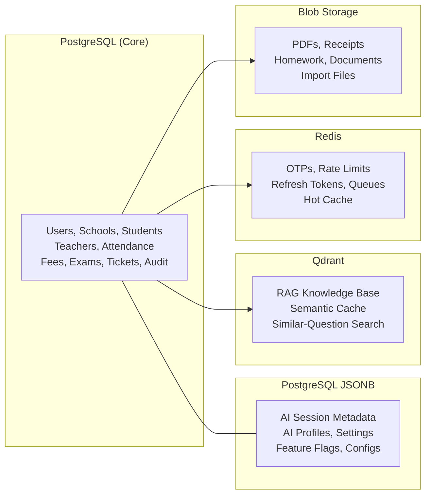

# Academix Platform — Production Implementation Plan (v2)

> **Status**: Awaiting Final Approval | **Target**: Production-ready for pilot (Sep 2026)
> **Repo**: `academix-platform` (Greenfield) | **Architecture**: Modular Monolith + Multi-Portal

---

## Design Reference


````carousel

<!-- slide -->

````

**Design System Extracted from Figma:**
- **Palette**: White/cream background, teal/mint hero banner, orange/green/blue accent buttons
- **Sidebar**: Light gray, icon+label, Academix logo at top, Settings at bottom
- **Cards**: Rounded corners, subtle shadow, pastel tint backgrounds
- **Typography**: Clean sans-serif (Inter/Outfit), bold section headers
- **Mobile (Parent)**: Card-based, donut chart for fees, child switcher, bottom tab nav

---

## Decisions Locked (from your feedback)

| Decision | Answer |
|----------|--------|
| Repo | **Greenfield** in `academix-platform` — **truly from scratch**, old repo is reference only |
| Backend | **Modular monolith** (FastAPI, single deployable) |
| Frontend | **Multiple apps**: `admin-web`, `teacher-web`, `parent-web`, `student-web`, `platform-web` |
| Pilot scope | **All 4 phases** including AI tutor |
| MongoDB | **No** — PostgreSQL + JSONB for everything |
| Data architecture | PostgreSQL → JSONB → Qdrant → Redis → Blob → Analytics warehouse (later) |
| Platform owner | **Yes**, separate portal with separate auth |
| Synthetic data | 2-3 schools, classes 1-8, sections A-D, ~30 students each |
| Code origin | **100% from scratch** — zero copy from `school-management-system` |

---

## Data Architecture (Final)



---

## Repository Structure (Greenfield)

```
academix-platform/
├── apps/
│   ├── api/                    # FastAPI modular monolith
│   │   ├── alembic/            # Linear migration chain
│   │   ├── app/
│   │   │   ├── core/           # config, database, deps, security, tenant
│   │   │   ├── db/models/      # All SQLAlchemy models
│   │   │   ├── modules/        # 13 domain modules
│   │   │   │   ├── auth/       # OTP, JWT, RBAC, cookies
│   │   │   │   ├── users/      # Profiles, onboarding
│   │   │   │   ├── academic/   # Classes, subjects, enrollments
│   │   │   │   ├── attendance/ # Marking, reports
│   │   │   │   ├── examinations/ # Exams, marks, report cards
│   │   │   │   ├── fees/       # Structures, payments, Razorpay
│   │   │   │   ├── timetable/  # Period scheduling
│   │   │   │   ├── communications/ # Notices, chat
│   │   │   │   ├── notifications/  # Push, SMS, email
│   │   │   │   ├── school_ops/ # Transport, library, events
│   │   │   │   ├── files/      # Upload, pre-signed URLs
│   │   │   │   ├── ai/         # Tutor, profiler, RAG
│   │   │   │   └── analytics/  # Dashboards, reports
│   │   │   ├── shared/         # Common schemas, pagination
│   │   │   └── workers/        # Outbox relay, background tasks
│   │   ├── scripts/            # seed_synthetic.py, reconciliation
│   │   └── tests/
│   ├── admin-web/              # Next.js — school admin portal
│   ├── teacher-web/            # Next.js — teacher portal
│   ├── parent-web/             # Next.js — parent portal
│   ├── student-web/            # Next.js — student portal
│   └── platform-web/           # Next.js — SaaS operator console
├── infra/
│   ├── docker/                 # docker-compose.dev.yml
│   ├── nginx/                  # Gateway config
│   └── azure/                  # Bicep IaC
├── docs/
│   ├── ADR/                    # Architecture Decision Records
│   ├── CODE_GRAPH.md
│   └── RUNBOOK.md
├── assets/                     # Logo, brand assets
│   ├── Logo.png
│   └── ...
└── .github/workflows/          # CI/CD
```

---

## 5 Portals + Platform Console

| Portal | Roles | Key Pages | Priority |
|--------|-------|-----------|----------|
| **admin-web** | admin, super_admin | Dashboard (Figma design), Students, Staff, Classes, Fees, Settings | Phase 1 |
| **teacher-web** | teacher, class_incharge | Class dashboard, Attendance, Grades, Timetable, AI copilot | Phase 2 |
| **parent-web** | parent | Child overview, Fee payment, Attendance, Report card, Notices | Phase 3 |
| **student-web** | student | Timetable, Marks, AI Tutor, Diary, Notices | Phase 3 |
| **platform-web** | platform_operator | School onboarding, Tenant management, Billing, Audit | Phase 6 |

---

## RBAC Matrix (Complete)

| Resource | student | parent | teacher | incharge | admin | super_admin | platform_operator |
|----------|---------|--------|---------|----------|-------|-------------|-------------------|
| Own profile | R | R/W | R/W | R | R/W | R/W | R/W |
| Child data | — | R(linked) | — | — | R/W | R/W | R(all, audited) |
| Class data | R(own) | R(child) | R/W(assigned) | R/W | R/W | R/W | R(all, audited) |
| School-wide | — | — | — | — | R/W | R/W | R(all) |
| Fee payment | R(own) | R/W(child) | — | — | R/W | R/W | R(all) |
| AI tutor | R/W | R | — | — | R | R/W | R(all, audited) |
| Platform ops | — | — | — | — | — | — | R/W |

> [!IMPORTANT]
> Platform operators have a **completely separate auth flow**, JWT namespace, and cookie. They **never** share tokens with school users. `platform-web` is an independent app.

---

## Synthetic Data Seed Plan

### Schools

| School | Name | Board | Classes | Sections | Students/Section |
|--------|------|-------|---------|----------|-----------------|
| School 1 | **Sunrise International Academy** | CBSE | 1-8 | A, B, C | ~30 |
| School 2 | **Green Valley Public School** | ICSE | 1-8 | A, B, C, D | ~30 |
| School 3 | **Little Stars School** | State Board | 1-8 | A, B | ~30 |

### Data Volume Per School (School 1 — 720 students)

| Entity | Count | Details |
|--------|-------|---------|
| Classes | 8 grades × 3 sections = **24** | Grade 1A, 1B, 1C → Grade 8A, 8B, 8C |
| Students | 24 × 30 = **720** | Indian names (Faker `en_IN`), realistic DOBs |
| **Parents** | **~500** | See parent linking rules below |
| Teachers | **40** | 5 subjects × 8 grades, some teach multiple sections |
| Class Incharges | **24** (1 per class) | Drawn from teacher pool |
| Subjects | **5 per class** = 120 mappings | English, Hindi, Math, Science, Social Studies |
| Admin | **2** | Principal + Vice Principal |
| Operations staff | **3** | Accountant, Librarian, Transport coordinator |

### Parent Data & Multi-Child Linking

> [!IMPORTANT]
> Parents are **not** 1:1 with students. Real Indian schools have siblings. The seed script must model this realistically.

**Linking Rules:**
- **~30% of parents** have **2 children** in the same school (siblings in different grades)
- **~5% of parents** have **3 children** (e.g., Grades 2, 5, 7)
- **~65% of parents** have **1 child** in this school
- Each student has **both a father and a mother** registered (2 parent records per family)
- One parent is marked `is_primary = true` (the phone used for OTP login)
- Parents share the **family surname** with their children

**Example Families:**

| Family | Father | Mother | Children |
|--------|--------|--------|----------|
| Sharma | Rajesh Sharma (primary) | Priya Sharma | Aarav (3A), Ananya (6B) |
| Patel | Vikram Patel (primary) | Meera Patel | Dhruv (1C), Ishaan (4A), Kavya (7B) |
| Reddy | Suresh Reddy | Lakshmi Reddy (primary) | Rohan (5A) |

**Generated Fields per Parent:**
- `full_name` — Indian name matching child surname
- `mobile` — unique `+91` number (Faker)
- `email` — `firstname.lastname@gmail.com`
- `relationship` — `father` or `mother`
- `is_primary` — true for the login parent

**`student_parent_map` table entries:**
```
student_id(Aarav)  → parent_id(Rajesh)   is_primary=true
student_id(Aarav)  → parent_id(Priya)    is_primary=false
student_id(Ananya) → parent_id(Rajesh)   is_primary=true   ← SAME parent, 2nd child
student_id(Ananya) → parent_id(Priya)    is_primary=false  ← SAME parent, 2nd child
```

### Subjects by Grade Band

| Grades | Subjects |
|--------|----------|
| 1-3 | English, Hindi, Mathematics, EVS (Env. Studies), Art & Craft |
| 4-5 | English, Hindi, Mathematics, Science, Social Studies |
| 6-8 | English, Hindi, Mathematics, Science, Social Studies |

### Attendance Data (3 months — July-September)
- ~65 working days per student
- 92% average attendance rate (realistic)
- Some students with chronic absenteeism (< 75%) for alert testing

### Exam & Grade Data
- **Unit Test 1** (August) — all subjects, all classes
- Marks: realistic bell curve distribution (mean 65%, std dev 15%)
- A few students with failing grades for risk alert testing

### Fee Data
- Fee structures: Tuition (monthly), Transport (quarterly), Library (annual)
- 80% paid, 15% pending, 5% overdue — realistic collection pattern

### Script: `apps/api/scripts/seed_synthetic.py`
- Async Python with `httpx.AsyncClient` + `asyncio.Semaphore(50)`
- Idempotent: checks if school slug exists before creating
- Generates deterministic data (seeded Faker for reproducibility)
- Outputs credentials file: `seed_credentials.json` (admin/teacher/parent/student logins)

---

## Phase Breakdown (All 4 for Pilot)

### Phase 1: Foundation (Weeks 1-4) — Backend Core + Admin Portal

**Backend (written from scratch):**
- [ ] Init greenfield repo with `git init`, `.gitignore`, `README.md`
- [ ] Build `app/core/`: `config.py` (Pydantic Settings), `database.py` (async SQLAlchemy), `dependencies.py` (JWT + RBAC), `security.py` (bcrypt + JWT), `tenant.py` (slug resolution)
- [ ] Build `app/db/models/`: all SQLAlchemy models with `school_id` on every table
- [ ] Build `app/modules/auth/`: OTP send/verify, JWT issue/refresh/logout, cookie-based refresh, RBAC `require_roles()`
- [ ] Build `app/modules/users/`: profile CRUD, role management, paginated list
- [ ] Build `app/modules/academic/`: classes, sections, subjects, teacher mapping, student enrollment, parent linking
- [ ] Build `app/modules/attendance/`: daily marking, reports, school summary
- [ ] Build `app/modules/examinations/`: exam CRUD, bulk marks entry (single flush), report cards
- [ ] Build `app/modules/fees/`: fee structures, student records, payment tracking
- [ ] Build `app/modules/timetable/`: period scheduling, conflict detection
- [ ] Build `app/modules/communications/`: notices with read receipts, target roles
- [ ] Build `app/modules/notifications/`: push (FCM), SMS (MSG91), email (SendGrid) dispatch
- [ ] Build `app/modules/school_ops/`: transport routes, library issue/return, events
- [ ] Build `app/modules/files/`: pre-signed URL generation for Azure Blob
- [ ] Build `app/shared/`: common response envelope, pagination schema, error codes
- [ ] Build `app/workers/`: outbox relay for cross-module events
- [ ] Alembic migrations: linear chain, every migration tested with `upgrade head` + `downgrade -1`
- [ ] Pagination on **all** list endpoints from day one
- [ ] Redis user cache (60s TTL) in `get_current_user` from day one
- [ ] Horizontal rate limiting on auth endpoints (Nginx + Redis)
- [ ] `structlog` JSON logging with `request_id`, `school_id`, `user_id` context
- [ ] Docker Compose dev environment (Postgres, Redis, Qdrant, Nginx)
- [ ] Synthetic data seed script (2-3 schools with parent multi-child linking)

**Admin Portal (`admin-web`):**
- [ ] Next.js 14 App Router, TypeScript, Tailwind CSS, shadcn/ui
- [ ] Academix branding (logo, color palette from Figma)
- [ ] Pages matching Figma: Dashboard, Students, Staff, Classes, Schedule, Finance, Announcements, Settings
- [ ] Hybrid auth: HttpOnly refresh cookie + in-memory access token
- [ ] Bento-box dashboard: Daily Overview, Upcoming Events, Class Progress, Quick Actions, Recent Notices

### Phase 2: Academic Operations (Weeks 5-8) — Teacher Portal + Full SMS

**Teacher Portal (`teacher-web`):**
- [ ] Class dashboard, attendance marking, grade entry
- [ ] Timetable view, assignment management
- [ ] Student list with progress indicators
- [ ] Report card generation (PDF)

**Backend enhancements:**
- [ ] Fee management with Razorpay integration (test mode)
- [ ] Transport route management
- [ ] Library management (issue/return)
- [ ] Notice/announcement system with read receipts
- [ ] Outbox worker for cross-module events

### Phase 3: Parent & Student Portals (Weeks 9-12)

**Parent Portal (`parent-web`):**
- [ ] Mobile-first design (matching Mobile Perspective mockup)
- [ ] Child switcher (multi-child support)
- [ ] Fee summary donut chart + Razorpay payment
- [ ] Attendance calendar view
- [ ] Report card download
- [ ] Notifications & alerts feed
- [ ] Teacher message thread (structured triad chat)

**Student Portal (`student-web`):**
- [ ] Timetable, marks, attendance self-view
- [ ] AI Tutor interface (Phase 4 integration)
- [ ] Notice board
- [ ] Digital diary/planner placeholder

### Phase 4: AI Layer (Weeks 13-16) — Tutor + Intelligence

**RAG Pipeline:**
- [ ] PDF ingestion → PyMuPDF extract → chunk (512 tokens) → embed (`text-embedding-004`) → Qdrant
- [ ] Per-school collections: `school_{id}_knowledge`
- [ ] Admin UI: upload syllabus, view indexed documents

**AI Tutor Agent:**
- [ ] LangGraph state machine: classify → retrieve → generate → cache
- [ ] 3-tier LLM: Gemini Flash → Gemini Pro → Ollama gemma
- [ ] Semantic cache: Redis exact + Qdrant similarity (>0.92)
- [ ] SSE streaming endpoint: `GET /api/v1/ai/tutor/stream`
- [ ] Content safety filter, max token limits, no PII

**Student Profiler:**
- [ ] Weekly background job (Celery Beat)
- [ ] Input: grades + attendance + AI sessions → JSONB profile
- [ ] Risk alerts: attendance < 75%, grade drop > 15%
- [ ] Push notification to parent + teacher on alert

---

## Security Architecture (Non-Negotiable)

| Layer | Control |
|-------|---------|
| **Access Token** | JWT, 15-min, in-memory only (never localStorage) |
| **Refresh Token** | HttpOnly, Secure, SameSite=Lax, path-scoped `/api/v1/auth/refresh`, 30-day |
| **Blacklist** | Redis SET, TTL = remaining token life |
| **OTP** | Redis 5-min TTL, max 3 attempts, 5-min cooldown |
| **Password** | bcrypt cost 12, fail-secure on malformed hashes |
| **Rate Limit** | Nginx `limit_req_zone` + Redis per-IP throttle on auth |
| **Tenant** | `school_id` on every row; resolution via subdomain slug (e.g., `sia.academix.com`) |
| **CORS** | Strict whitelist, crash on `*` or `localhost` in production |
| **Secrets** | Azure Key Vault (prod), `.env` (dev only, gitignored) |
| **Encryption** | TLS 1.3 in transit, Azure managed keys at rest |
| **Audit** | Append-only log for admin/AI actions |
| **DPDP** | Parental consent for AI, data retention config, right to delete |
| **Platform Auth** | Separate JWT namespace, separate cookie, separate portal |

> [!TIP]
> **Tenant Resolution Strategy**:
> - **Frontend**: Extracts the slug (e.g., `sia`) from the browser host header.
> - **Backend**: `tenant.py` middleware resolves the slug to a `school_id` from the database.
> - **Isolation**: All database queries are automatically scoped by the resolved `school_id`.
> - **Custom Domains**: Supports custom school domains (e.g., `portal.sunriseacademy.in`) by mapping them to the internal slug.

---

## Infrastructure (Pilot → Production)

| Component | Dev (Laptop) | Pilot (Azure Free) | Production (10 schools) |
|-----------|-------------|--------------------|-----------------------|
| PostgreSQL | Docker | Azure Flex Free 32GB | Azure Flex B2ms |
| Redis | Docker | Azure Basic C0 | Azure Standard C1 |
| Qdrant | Docker | Qdrant Cloud Free 1GB | Qdrant Cloud Paid |
| Compute | Docker Compose | Container Apps (0.5 vCPU) | Container Apps (1 vCPU × 3) |
| Storage | Local/MinIO | Azure Blob 5GB | Azure Blob unlimited |
| LLM | Ollama local | Gemini Flash free 1500/day | Gemini Flash + Pro paid |
| Frontend | localhost:3000 | Azure Static Web Apps | Azure Static Web Apps + CDN |
| Secrets | .env files | Azure Key Vault | Azure Key Vault |
| Monitoring | Console logs | structlog → console | Azure Monitor + Log Analytics |
| CI/CD | Manual | GitHub Actions → pilot branch | GitHub Actions → main branch |

---

## CI/CD Pipeline

```yaml
# .github/workflows/api-ci.yml triggers on PR to main
Steps: ruff lint → mypy → pytest → alembic upgrade head (ephemeral PG)

# .github/workflows/deploy-pilot.yml triggers on merge to pilot
Steps: Docker build → ACR push → Azure Container Apps deploy → smoke test
```

---

## Verification Plan

### Per-Phase Gates

| Phase | Gate | How |
|-------|------|-----|
| 1 | All pytest green, admin-web loads, seed data visible | `pytest -v`, Playwright smoke |
| 2 | Teacher marks attendance, enters grades, generates report card | Manual + E2E |
| 3 | Parent pays fee (Razorpay test), views report card on mobile | Manual + Playwright |
| 4 | Student asks math question, gets RAG answer, cache hit on repeat | API test + manual |

### Security Checks (Monthly)
- OWASP ZAP scan
- IDOR test: parent → other parent's child → 403
- Tenant isolation: School A token → School B data → 403
- JWT blacklist: logout → reuse → 401
- No secrets in logs

### Load Test (Pre-pilot)
- Locust: 500 concurrent, P95 < 200ms
- Semantic cache hit > 50%

---

## Decision: Truly From Scratch

> [!IMPORTANT]
> **Locked**: All modules will be written from scratch. **Zero code** will be copied from `school-management-system`. The old repo serves only as a **reference** for:
> - Lessons learned (security audit findings, RBAC patterns, cookie auth design)
> - Schema design patterns (tenant isolation, outbox, JSONB usage)
> - API contract shapes (request/response envelopes)
>
> Every file — models, services, endpoints, migrations, configs, tests, frontend — is written fresh with the benefit of hindsight.

**Why this is better:**
- No inherited tech debt (broken migrations, dead imports, schema mismatches)
- Clean git history from commit #1
- Correct patterns baked in from the start (pagination everywhere, cached user lookup, bulk writes)
- Proper test coverage from day one (no 5 broken tests carried forward)
- Single consistent code style and naming convention

---

*Approve this plan to begin execution. I will create `task.md` and start with Phase 1 Week 1: greenfield repo init, core infrastructure, auth module, and seed script.*
