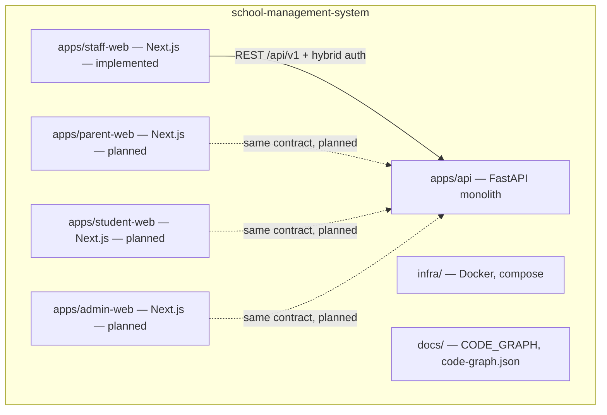
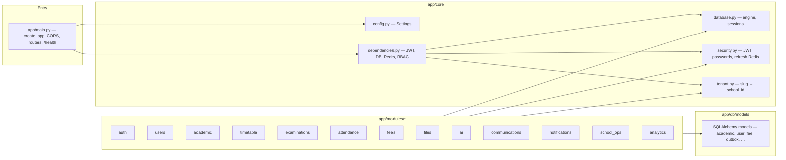
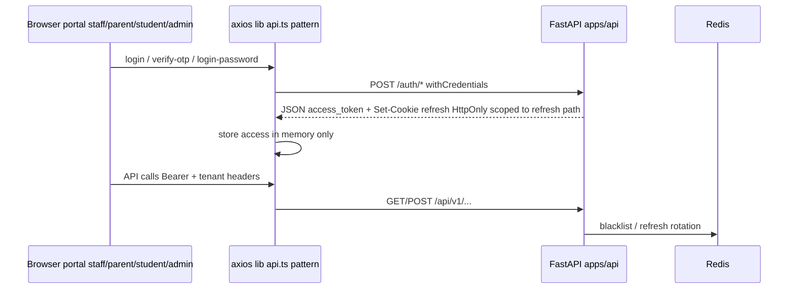
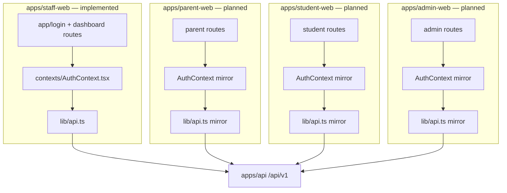
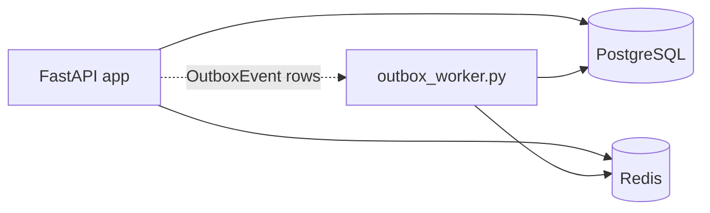

# School Management System — Code & Knowledge Graph

Use this document to orient an agent to the repository: layout, runtime boundaries, multi-portal plan, and where to change code. **Machine-readable graph:** [`docs/code-graph.json`](code-graph.json) (`nodes` / `edges`) — prefer ingesting that file for Graph RAG / tooling.

---

## 1. How to read this repo (agent checklist)

| Question | Where to look |
|----------|----------------|
| HTTP API routes | `apps/api/app/main.py` → `include_router` list; each module’s `endpoints/*.py` |
| Request auth / RBAC | `apps/api/app/core/dependencies.py` (`CurrentUser`, `require_roles`) |
| Multi-tenant resolution | `apps/api/app/core/tenant.py` + `X-Tenant-Slug` / `School.tenant_slug` |
| DB models | `apps/api/app/db/models/` |
| Migrations | `apps/api/alembic/versions/` |
| Business logic | `apps/api/app/modules/<domain>/services/` |
| Request/response shapes | `apps/api/app/modules/<domain>/schemas/` |
| **Staff** browser UI | `apps/staff-web/src/app/` (Next.js App Router) |
| **Staff** API client & auth | `apps/staff-web/src/lib/api.ts`, `src/contexts/AuthContext.tsx` |
| **Parent / student / admin** UI (planned) | `apps/parent-web`, `apps/student-web`, `apps/admin-web` — same pattern as staff-web when scaffolded |
| Background worker | `apps/api/app/workers/outbox_worker.py` + `app/db/models/outbox.py` |
| Config / env | `apps/api/app/core/config.py`; each app: `NEXT_PUBLIC_API_URL`, `NEXT_PUBLIC_TENANT_BASE_DOMAIN` |

**Conventions (API modules):** `endpoints/` → `services/` → `schemas/`. Shared envelope: `apps/api/app/shared/schemas/common.py`.

---

## 2. Repository topology (all web portals → one API)

**Planned portal split (product intent):**

| App | Path (convention) | Typical roles | Notes |
|-----|-------------------|---------------|--------|
| Staff | `apps/staff-web` | teacher, class_incharge, operations, … | Exists today |
| Parent | `apps/parent-web` | parent | Fees, notices, child progress — mirror `api.ts` + `AuthContext` pattern |
| Student | `apps/student-web` | student | Timetable, attendance self-view, marks — same API |
| Admin | `apps/admin-web` | admin, super_admin | May overlap staff admin pages or be a dedicated super-admin shell |

All portals target the **same** `apps/api` monolith under **`/api/v1`**. Native **mobile** clients (future) would still call the same API but use **platform secure storage** for refresh tokens, not browser cookies.

---

## 3. Backend (`apps/api`) — application graph

**Router mount order** (`/api/v1`):  
`auth` → `users` → `academic` → `timetable` → `examinations` → `attendance` → `fees` → `files` → `ai` → `communications` → `notifications` → `school_ops` → `analytics`.

---

## 4. Auth & session (hybrid) — any browser portal

**Implementation today:** `apps/api/app/modules/auth/cookie_util.py`, `auth/endpoints/auth.py`, `staff-web/src/lib/api.ts`.

---

## 5. Frontend portals — map to API (staff implemented; others planned)

**Staff dashboard routes (reference):** `dashboard`, `academics`, `students`, `students/[id]`, `teachers`, `timetable`, `attendance`, `fees`, `communication`, `operations`, `users`, `settings`, `notifications`, `reports`, `report-card`, `my-payments`, etc.

---

## 6. Data & async processing

---

## 7. Machine-readable graph (JSON)

**Canonical file:** [`docs/code-graph.json`](code-graph.json)

- Contains **`meta`**, **`nodes`** (apps, modules, packages, `status: implemented|planned`), and **`edges`** (REST client, `uses`, migrations, outbox).
- Ingest this JSON into a **vector DB** (chunk metadata), a **property graph** (Neo4j / Neptune: nodes + edges), or an **agent context pack** (load JSON + selective file reads).

Do **not** duplicate large JSON in this markdown file — update **`code-graph.json`** when the repo topology changes.

---

## 8. Knowledge graph / Graph RAG over the entire codebase — is it possible?

**Yes, it is possible** — but “knowledge graph for the whole code” is usually a **pipeline + index**, not a single button.

| Approach | What you get | Effort |
|----------|----------------|--------|
| **Structured graph (this doc + JSON)** | High-level nodes (apps, modules, DB); good for **onboarding agents** and product-level RAG metadata. | Low — already started. |
| **Import / call graph** | File → file, symbol → symbol; good for **refactors** and “who calls X”. | Medium — tree-sitter, LSP, or `pyright`/`typescript` project references, or tools like Sourcegraph. |
| **Chunk + embed (classic RAG)** | Semantic search over README, `docs/`, and source **chunks**; no true graph unless you add edges. | Medium — split by file/function, embed with your embedding model, store in pgvector / Azure AI Search / etc. |
| **Graph RAG (Microsoft / LlamaIndex style)** | **Communities** on a graph (modules, imports, doc links) + retrieval that walks edges + text chunks. | Higher — build or adopt a graph extractor, keep index updated on CI. |

**Practical recipe for this repo:**

1. **Keep** `docs/code-graph.json` as the **skeleton graph** (product & module level).
2. **Add** automated extraction: Python `imports` graph under `apps/api`, TS `import` graph under each `apps/*-web`, merge into JSON or Neo4j.
3. **Chunk** code + markdown; **embed** chunks; store `file_path`, `symbol`, `module_id` linking back to graph nodes.
4. **Refresh** on every merge (CI job) so the “knowledge graph” does not rot.

**Limits:** Generated graphs miss **runtime** behavior (Redis keys, middleware order); combine graph + a few **pinned docs** (this file, `main.py` router list) for best agent answers.

---

## 9. Suggested prompt snippet (when handing this to another agent)

> You are working in **school-management-system**. Read **`docs/CODE_GRAPH.md`** and load **`docs/code-graph.json`** for the topology graph. Backend: **FastAPI** `apps/api`, routers under `app/modules/<domain>/endpoints`, logic in `services/`. API prefix **`/api/v1`**. Implemented UI: **`apps/staff-web`** (`src/lib/api.ts`, hybrid auth). Planned UIs: **`apps/parent-web`**, **`apps/student-web`**, **`apps/admin-web`** — same REST + auth pattern as staff when built.

---

*Update `docs/code-graph.json` when you add routes, new apps, or major modules.*
