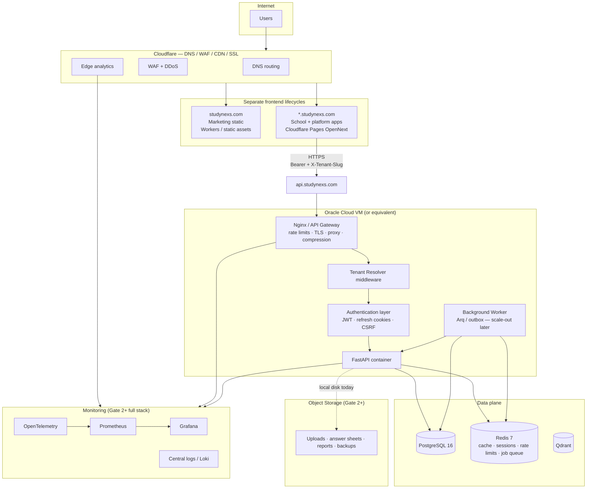

# StudyNexs — Deployment Architecture

> **Infrastructure equivalent of [`/CLAUDE.md`](../CLAUDE.md).** Read this before making deployment,
> hosting, DNS, or environment decisions. URL semantics: [`URL_ARCHITECTURE.md`](./URL_ARCHITECTURE.md).

> **Owner:** Avinash Reddy Masapeta · **Status:** v1.0 draft · **Last updated:** 2026-07-16  
> **Approved in draft form** — proceed to Gate 1A; freeze as **v1.0 (Frozen)** after HTTPS + smokes ([`DEPLOYMENT_CONVENTIONS.md`](./DEPLOYMENT_CONVENTIONS.md) §12).

---

## 1. Purpose

Define how StudyNexs runs in non-local environments: environments, cloud topology, networking,
Docker layout, deployment flow, backups, monitoring, and scaling path. **Implementation is
authoritative** when this doc drifts — update this file after deploy changes.

**This document answers:** *Where does the software run?*

For internal product layers and request paths, see [`PLATFORM_ARCHITECTURE.md`](./PLATFORM_ARCHITECTURE.md).
Do not merge deployment and platform into one diagram.

---

## 2. Read order for agents

```
/CLAUDE.md                       → engineering policy
docs/URL_ARCHITECTURE.md         → hostnames, tenant routing, JWT rules
docs/DEPLOYMENT_ARCHITECTURE.md  → this file (where it runs)
docs/DEPLOYMENT_CONVENTIONS.md  → VM layout, compose, env, backups (implementation contract)
docs/PLATFORM_ARCHITECTURE.md    → how it is organized + request flow
docs/PLATFORM_STATUS.md          → current engineering state
docs/pilot/GATE1_EXECUTION.md    → demo deploy checklist
```

---

## 3. Environment strategy

```
localhost          → developer machine (uvicorn + next dev)
        ↓
dev.studynexs.com  → shared dev stack (optional)
        ↓
test.studynexs.com → QA / pre-release
        ↓
demo.studynexs.com → sales / principal demo (Gate 1)
        ↓
app.studynexs.com  → production application
        ↓
{school}.studynexs.com → per-school tenant frontends (pilot+)
```

| Environment | `ENVIRONMENT` | Data | AI providers |
|-------------|---------------|------|--------------|
| Local | `development` | Seed / synthetic | Stub or live keys |
| Dev / Test | `development` or dedicated | Non-production | Live keys, metered |
| Demo | `production` | Synthetic only | Live keys + fallbacks |
| Production | `production` | Real school data | Live keys, no stub |

Production boot guardrails (`apps/api/app/core/config.py`) **refuse to start** with weak JWT,
localhost CORS/Redis, missing encryption keys, or stub AI.

---

## 4. Cloud architecture (target)

### 4.1 Primary path (Gate 1 → pilot)

| Layer | Service | Role |
|-------|---------|------|
| Edge / CDN | **Cloudflare** | Pages (web), WAF, TLS, DNS |
| API compute | **Oracle Cloud VM** (or Azure ACA) | Docker: Nginx + FastAPI |
| Database | **PostgreSQL 16** | Co-located or managed |
| Cache / queue | **Redis 7** | Auth, rate limits, Arq |
| Vector DB | **Qdrant** | RAG / copilots (independent service) |
| Object storage | **OCI Object Storage** (future) | Uploads — local disk until Gate 2+ |
| Marketing | Cloudflare Workers / static | `studynexs.com` (`sites/studynexs-web`) |

Handover also references Azure Container Apps + Front Door (`infra/azure/`). The application is
**host-agnostic** — pick one primary path per environment and document it here.

### 4.2 Deployment Architecture diagram (infrastructure only)

**Rating target:** evolve toward 10/10; v1.1 draft ~8.5/10 after separating marketing vs school apps,
API gateway, monitoring, and storage purposes. **Not frozen** until Gate 1A validates live paths.



**Intentionally not in this diagram:** AI Gateway, RAG Engine, Company DNA, copilots — those belong
in [`PLATFORM_ARCHITECTURE.md`](./PLATFORM_ARCHITECTURE.md) so deployment stays readable.

### 4.3 Marketing vs school applications

| Surface | Host | Deploy | Lifecycle |
|---------|------|--------|-----------|
| Marketing | `studynexs.com` | Root `wrangler.toml` → `sites/studynexs-web` | Brand / content releases |
| Product | `demo`, `app`, `{school}.studynexs.com` | `apps/admin-web` OpenNext → Cloudflare Pages | Product sprint cadence |

Different teams, cadences, and rollback policies — keep DNS and deploy pipelines separate.

---

## 5. Networking

### 5.1 DNS (minimum for Gate 1A)

| Record | Target |
|--------|--------|
| `demo.studynexs.com` | Cloudflare Pages (admin-web) |
| `api.studynexs.com` | OCI VM / load balancer (Nginx) |
| `studynexs.com` | Marketing static |

Pilot: wildcard `*.studynexs.com` → Pages when runtime tenant routing is live.

### 5.2 TLS

- Terminate TLS at Cloudflare (web) and Nginx or cloud LB (API).
- API: `COOKIE_SECURE=true`, HTTPS-only origins in `ALLOWED_ORIGINS`.

### 5.3 CORS and cookies

- `ALLOWED_ORIGINS` lists every frontend origin (e.g. `https://demo.studynexs.com`).
- Refresh cookie is set on **API host**; frontends use `credentials: "include"`.
- Refresh CSRF: `Origin` / `Referer` must match `ALLOWED_ORIGINS` (`app/core/csrf.py`).

### 5.4 Shared API host (P0-01)

`api.studynexs.com` is a **platform host**. Tenant comes from `X-Tenant-Slug`, not Host.
See [`URL_ARCHITECTURE.md`](./URL_ARCHITECTURE.md) §5.1.

---

## 6. Docker topology

### 6.0 OCI VM filesystem layout

On the production API host, all StudyNexs paths live under **`/opt/studynexs/`**. Operational detail:
[`DEPLOYMENT_CONVENTIONS.md`](./DEPLOYMENT_CONVENTIONS.md) (implementation contract).

```
/opt/studynexs/
├── repo/                   # Git clone — source of truth, reproducible from Git
├── runtime/                # Active deploy metadata (image tag, deploy id) — not in Git
├── data/                   # Persistent state (DB, uploads, Qdrant bind roots)
├── backups/                # Backup staging before off-VM copy
├── deploy/                 # Active deployment artifacts for this host
│   ├── compose/
│   ├── env/
│   ├── nginx/
│   ├── scripts/
│   └── ssl/
└── monitoring/             # Active observability config/data (Gate 2+)
```

**Git vs VM:** `repo/infra/` is version-controlled; `deploy/` holds the **copied/synchronized**
artifacts Compose and Nginx use on this machine. See conventions doc §2–§3.

**Operational facts** (SSH, IP, DNS, backup schedules): [`infra/inventory/`](../infra/inventory/) — not duplicated here.

### 6.1 Development (`infra/docker/docker-compose.dev.yml`)

| Service | Image | Port |
|---------|-------|------|
| postgres | postgres:16-alpine | 5432 |
| redis | redis:7-alpine | 6379 |
| qdrant | qdrant/qdrant | 6333 |
| api | build `apps/api/Dockerfile` | 8000 |
| nginx | nginx:alpine | 80 |

### 6.2 Production API image (`apps/api/Dockerfile`)

- Base: `python:3.11-slim`
- Install: `pip install -e ".[ai,observability,rag]"` (**rag required for Qdrant**)
- User: non-root `appuser`
- Uploads: `/app/uploads` (volume mount until object storage)
- CMD: `uvicorn app.main:app --host 0.0.0.0 --port 8000`

### 6.3 Web (Cloudflare)

- Build: `npm run cf:build` (OpenNext)
- Deploy: `npm run cf:deploy`
- Config: `apps/admin-web/wrangler.jsonc`, `open-next.config.ts`
- Build-time env: `NEXT_PUBLIC_API_URL`, `NEXT_PUBLIC_TENANT_BASE_DOMAIN`, optional `NEXT_PUBLIC_TENANT_SLUG`

### 6.4 Workers (optional)

- Embedded outbox worker runs **inside** API process today.
- Scale-out: separate Arq worker container sharing Redis + Postgres (future).

---

## 7. Deployment flow

### 7.1 Prerequisites (Batch 29 — Infrastructure Readiness)

- [x] Reserved platform subdomains on API (`tenant.py`)
- [x] Runtime tenant slug on web (`getTenantSlug()`)
- [x] Dockerfile includes `[rag]`
- [x] This document + `URL_ARCHITECTURE.md` + `DEPLOYMENT_CONVENTIONS.md`

### 7.2 Gate 1A — API

1. Bootstrap VM layout per [`DEPLOYMENT_CONVENTIONS.md`](./DEPLOYMENT_CONVENTIONS.md) §9 (`/opt/studynexs/{repo,deploy,data,...}`).
2. Sync `repo/infra/` → `deploy/{compose,nginx,scripts}`; create `deploy/env/api.env`.
3. Set production env vars (§8).
4. `docker compose` build from `deploy/compose/` → image `studynexs-api:<tag>`.
5. `alembic upgrade head` from `repo/apps/api` against target database.
6. Run demo seed (`seed_demo_e2e_journey.py` or equivalent).
7. Point `api.studynexs.com` → Nginx → API container.
8. Verify `/health`, `/ready`, login with `X-Tenant-Slug`.

### 7.3 Gate 1A — Web

1. Set `NEXT_PUBLIC_API_URL=https://api.studynexs.com`.
2. Set `NEXT_PUBLIC_TENANT_BASE_DOMAIN=studynexs.com` (for school subdomains later).
3. For demo host: `NEXT_PUBLIC_TENANT_SLUG=demo` (or `test`).
4. `npm run cf:deploy`.
5. Add demo origin to API `ALLOWED_ORIGINS`.

### 7.4 Validation

- `python apps/api/scripts/smoke_demo_readiness.py` (set `BASE` to public API URL)
- `E2E_BASE_URL=https://demo.studynexs.com npm run e2e-smoke`
- Manual: login → dashboard → AI paper generation

Detail: [`pilot/GATE1_EXECUTION.md`](./pilot/GATE1_EXECUTION.md).

---

## 8. Environment variables (production)

### Required

| Variable | Notes |
|----------|-------|
| `ENVIRONMENT=production` | Enables guardrails |
| `JWT_SECRET_KEY` | ≥32 chars, unique |
| `POSTGRES_*` | Database connection |
| `REDIS_URL` | Non-localhost |
| `ALLOWED_ORIGINS` | HTTPS frontend origins |
| `COOKIE_SECURE=true` | |
| `AADHAAR_ENCRYPTION_KEYS` | Fernet key(s) |
| `AI_DEFAULT_PROVIDER` + matching API key | e.g. `GEMINI_API_KEY` |
| `WEBHOOK_SECRET` | Non-default |
| `TENANT_BASE_DOMAIN=studynexs.com` | |
| `OPENAI_API_KEY` | Embeddings default |
| `QDRANT_HOST`, `QDRANT_PORT` | (+ `QDRANT_API_KEY` if secured) |

### Web build (Cloudflare)

| Variable | Notes |
|----------|-------|
| `NEXT_PUBLIC_API_URL` | `https://api.studynexs.com` |
| `NEXT_PUBLIC_TENANT_BASE_DOMAIN` | `studynexs.com` |
| `NEXT_PUBLIC_TENANT_SLUG` | Platform hosts only (demo, app) |

### Optional

`COOKIE_DOMAIN`, `METRICS_TOKEN`, `OTEL_*`, `AI_FALLBACK_PROVIDER`, `OLLAMA_*`, `TUTOR_TTS_*`,
`AZURE_SPEECH_*`, `MSG91_*`, `SENDGRID_*`, `RAZORPAY_*`.

### Future (Gate 2+)

`AZURE_STORAGE_*` or OCI object storage equivalents, FCM, separate worker URLs.

---

## 9. Database

- **Engine:** PostgreSQL 16, async SQLAlchemy + asyncpg.
- **Migrations:** Alembic — `cd apps/api && alembic upgrade head`.
- **Isolation:** Application-level `school_id` on all tenant rows (no RLS today).
- **Backups (required before pilot):** Daily logical backup (`pg_dump`), test restore quarterly.
  Document RPO/RTO when OCI path is chosen.
- **Connection pool:** `DATABASE_POOL_SIZE=20`, `DATABASE_MAX_OVERFLOW=10`.

---

## 10. Qdrant

- Runs as **separate service** — not embedded in API container.
- Tenant isolation: every vector payload includes `school_id`; searches hard-filter.
- Collections named by embedding provider + dimensions (`vectorstore/factory.py`).
- Production: enable `QDRANT_API_KEY`, restrict network to API host.

---

## 11. Storage

| Phase | Backend | Acceptable for |
|-------|---------|----------------|
| Now | Local disk `/app/uploads` | localhost, demo, early pilot |
| Gate 2+ | OCI Object Storage (or Azure Blob) | production, multi-instance API |

`FileService` today writes local files only — plan object storage before horizontal API scaling.

---

## 12. Monitoring and observability

**Edge + origin** — Cloudflare analytics/WAF events complement origin metrics.

| Layer | Component | Mechanism |
|-------|-----------|-----------|
| Edge | Cloudflare | WAF events, traffic analytics, bot scores |
| Gateway | Nginx | Access logs, rate-limit 429s |
| App | FastAPI | structlog — **never log PII** |
| Metrics | Prometheus | `/metrics` (`METRICS_TOKEN` in prod) |
| Traces | OpenTelemetry | `OTEL_*` → collector (`infra/observability/`) |
| Dashboards | Grafana | `infra/observability/grafana/` |
| Logs | Loki (future) | Centralize Nginx + app logs |
| Alerts | Prometheus rules | `infra/observability/prometheus-alerts.yml` |

Flow: **Cloudflare / Nginx / API → monitoring → logs + metrics + traces → alerts → Grafana**.

---

## 13. Disaster recovery (minimum)

| Asset | Action |
|-------|--------|
| Postgres | Daily backup, off-VM storage, documented restore |
| Redis | Recreatable (sessions/OTP); not primary data store |
| Qdrant | Re-index from CurriculumPack if lost; backup for large pilots |
| Uploads | Object storage versioning when migrated |
| Secrets | Secret manager / env injection — never in git |

---

## 14. Scaling roadmap

| Stage | Compute | Notes |
|-------|---------|-------|
| Gate 1 | Single OCI VM, single API container | Demo reliability |
| Pilot | VM + managed Postgres option | Backups, monitoring |
| Growth | Multiple API replicas behind LB | Requires object storage + sticky sessions or stateless uploads |
| Scale | OCI paid → Azure (optional) | Front Door WAF bicep exists |

Vertical scale first; horizontal scale blocked until uploads leave local disk.

---

## 15. Security checklist (deploy)

- [ ] Production env validator passes on boot
- [ ] No Postgres/Redis/Qdrant exposed to public internet without auth
- [ ] Nginx rate limits enabled (`infra/nginx/nginx.conf`)
- [ ] WAF / Cloudflare protection on public hosts
- [ ] Demo uses synthetic data only; banner visible (`DemoDataBanner`)
- [ ] Smokes green on HTTPS URLs

---

## 16. Change control

Update this document when:

- Primary cloud provider changes
- New required env vars are added
- Docker services or deploy commands change
- Backup/DR procedures are defined

Cross-link updates in `PLATFORM_STATUS.md` and `docs/engineering/roadmap.json`.
