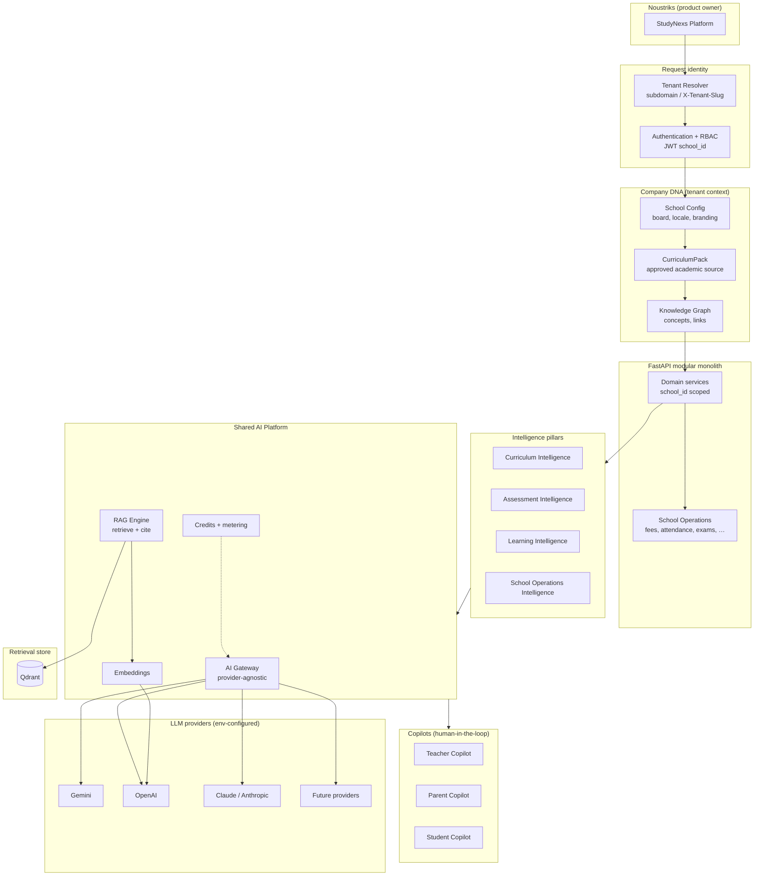
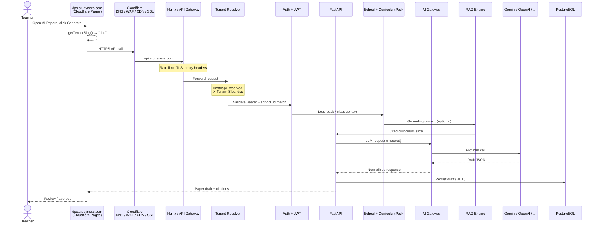
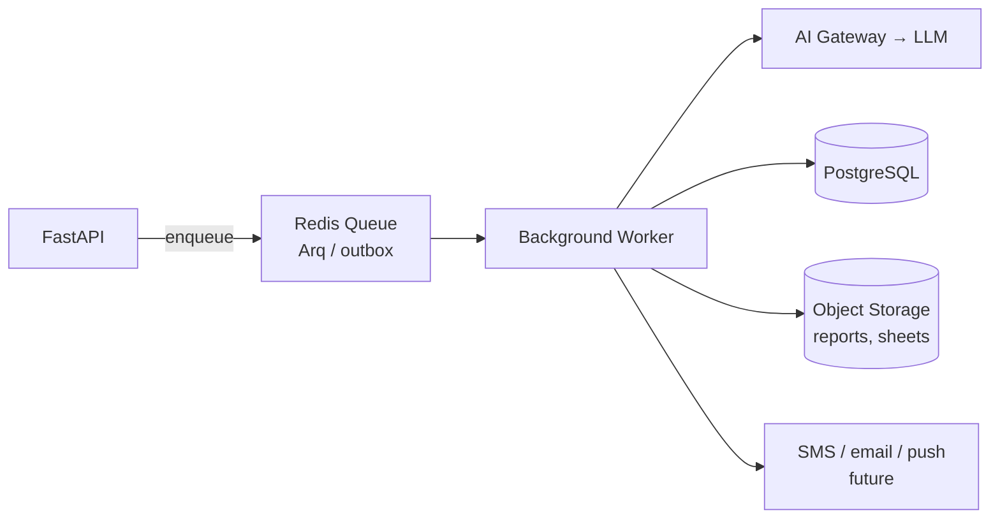
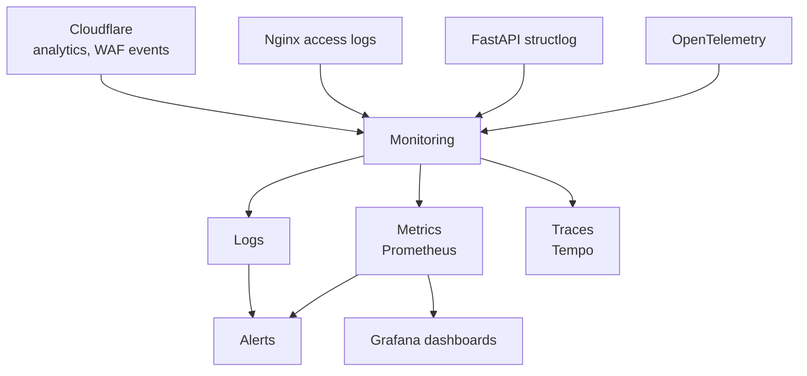

# StudyNexs — Platform Architecture

> **How the system is organized internally** — product layers, AI platform, and request paths.
> **Where software runs:** [`DEPLOYMENT_ARCHITECTURE.md`](./DEPLOYMENT_ARCHITECTURE.md).
> **What each hostname means:** [`URL_ARCHITECTURE.md`](./URL_ARCHITECTURE.md).
> **Engineering policy:** [`/CLAUDE.md`](../CLAUDE.md).

**Owner:** Avinash Reddy Masapeta · **Status:** v1.0 draft · **Last updated:** 2026-07-16  
> Freeze after Gate 1A — see [`DEPLOYMENT_CONVENTIONS.md`](./DEPLOYMENT_CONVENTIONS.md) §12.

---

## 1. Three diagrams — three questions

StudyNexs maintains **three architecture views**. Do not merge them into one diagram.

| Diagram | Document | Answers |
|---------|----------|---------|
| **Deployment Architecture** | [`DEPLOYMENT_ARCHITECTURE.md`](./DEPLOYMENT_ARCHITECTURE.md) | Where does the software run? |
| **Platform Architecture** | This file | How is the system organized internally? |
| **Request Flow** | This file §3 | How does a user's request travel through the system? |

Update the diagram that matches the change you are making. Cross-link when a concept spans views.

---

## 2. Platform Architecture (conceptual)

This is the **Noustriks / StudyNexs product stack** — not infrastructure. It shows why StudyNexs is
not a generic multi-tenant CRUD app.

### 2.1 What “Company DNA” means here

**Company DNA** is the tenant-specific academic and operational context that makes AI outputs
**school-grounded**, not generic:

| Layer | Implementation (today) | Role |
|-------|------------------------|------|
| School config | `School` row — board, slug, settings | Who this tenant is |
| CurriculumPack | `app/modules/curriculum` — versioned packs | What we teach (content is data) |
| Knowledge Graph | Concepts, links, ConceptCards | Structured curriculum + mastery spine |
| Tenant scope | `school_id` on every row + vector filter | Isolation |

Generic SaaS stops at tenant ID. StudyNexs adds **approved curriculum** as the grounding layer
for papers, evaluation, copilots, and tutor content.

### 2.2 AI Gateway vs direct provider calls

**No domain code calls Gemini/OpenAI directly.** All LLM traffic goes through
`app/modules/ai/gateway` — provider selection, timeouts, metering, and safe error mapping live
there. Diagrams must show **FastAPI → AI Gateway → providers**, not FastAPI → Gemini.

### 2.3 RAG vs Qdrant

**Qdrant is storage.** **RAG Engine** (`app/modules/ai/rag`) owns chunking, embedding, retrieval,
re-ranking, and citation formatting. Flow: **FastAPI → RAG Engine → Embeddings → Qdrant**.

---

## 3. Request Flow — teacher generates a question paper

End-to-end path for a representative AI workflow (Assessment Intelligence).

### 3.1 Request flow checklist

| Step | Component | Failure mode |
|------|-----------|--------------|
| 1 | Frontend tenant slug | Wrong school if hostname/env misconfigured |
| 2 | Cloudflare | WAF block, cache miss |
| 3 | Nginx | Rate limit 429 |
| 4 | Tenant resolver | 400 if no slug on platform API host |
| 5 | JWT + tenant match | 401 / 403 cross-tenant |
| 6 | Company DNA / pack | 400 ungrounded generation refused |
| 7 | AI Gateway | 503 provider down → fallback (Gate 1B) |
| 8 | HITL | Teacher approves before publish |

---

## 4. Background processing (async path)

Long-running work (eval jobs, notifications, future analytics) uses **Redis-backed queues**, not
synchronous HTTP.

| Redis role | Uses today |
|------------|------------|
| Cache | User session cache (60s TTL) |
| Sessions / auth | OTP, refresh JTIs, token blacklist |
| Rate limits | Per user + school |
| Background jobs | Arq + embedded outbox worker |

**Today:** outbox worker runs **inside** the API process. **Scale-out:** separate worker container
(same Redis + Postgres + AI Gateway).

---

## 5. Storage (logical)

Object storage is **provider-agnostic** in diagrams (OCI, Azure, S3-compatible).

| Bucket purpose | Examples |
|----------------|----------|
| Student uploads | Profile docs, admission files |
| Answer sheets | Exam scan uploads |
| Generated reports | PDF report cards, export papers |
| Backups | DB dumps, config snapshots (off-VM) |

**Today:** local disk (`/app/uploads`) — acceptable for demo/pilot only.

---

## 6. Monitoring (platform view)

Observability spans **edge and origin**:

Scaffold: `infra/observability/` (Prometheus, Grafana, Tempo, OTEL collector). Production cutover
is Gate 2+.

---

## 7. Maturity note

This diagram set is **v1.0 draft** — intentionally not frozen until after Gate 1A deploy validates
the paths. Revise when:

- Object storage replaces local disk
- Workers split from API
- Company DNA gains explicit provisioning APIs
- New intelligence pillars ship (Batch 30+)

---

## 8. Related documents

| Document | Scope |
|----------|-------|
| [`DEPLOYMENT_ARCHITECTURE.md`](./DEPLOYMENT_ARCHITECTURE.md) | Cloud, Docker, env, deploy flow |
| [`URL_ARCHITECTURE.md`](./URL_ARCHITECTURE.md) | Hostnames, reserved subdomains |
| [`PRODUCT.md`](./PRODUCT.md) | Product vision, four pillars |
| [`PLATFORM_STATUS.md`](./PLATFORM_STATUS.md) | Live engineering state |
