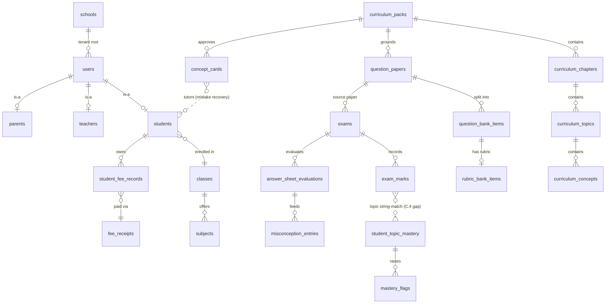
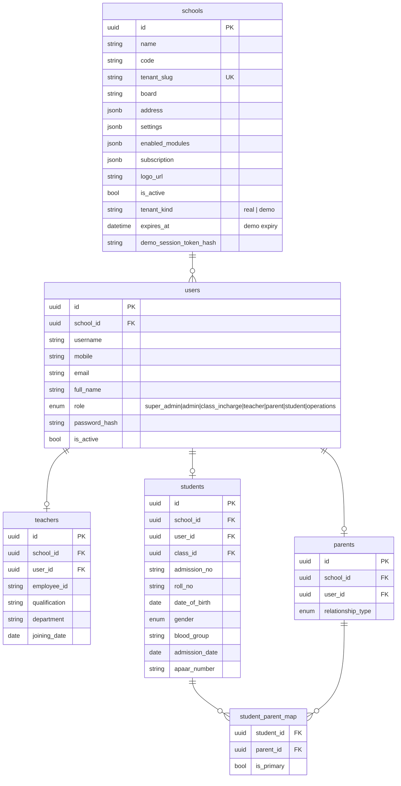
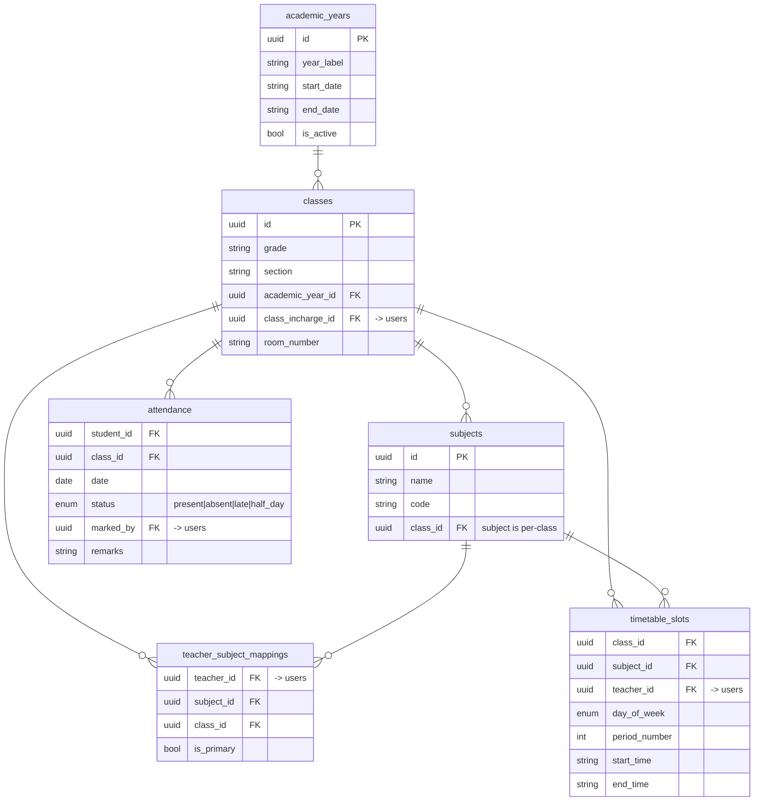
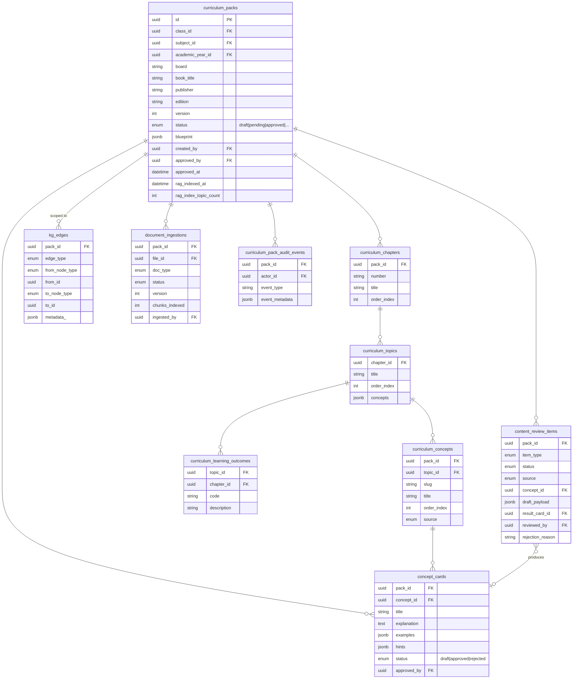
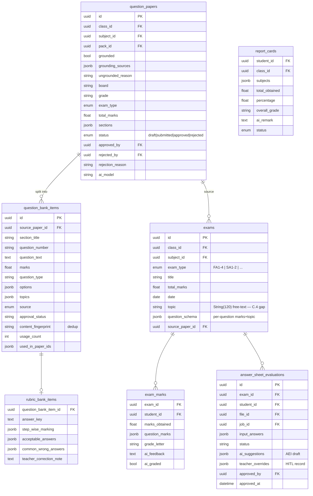
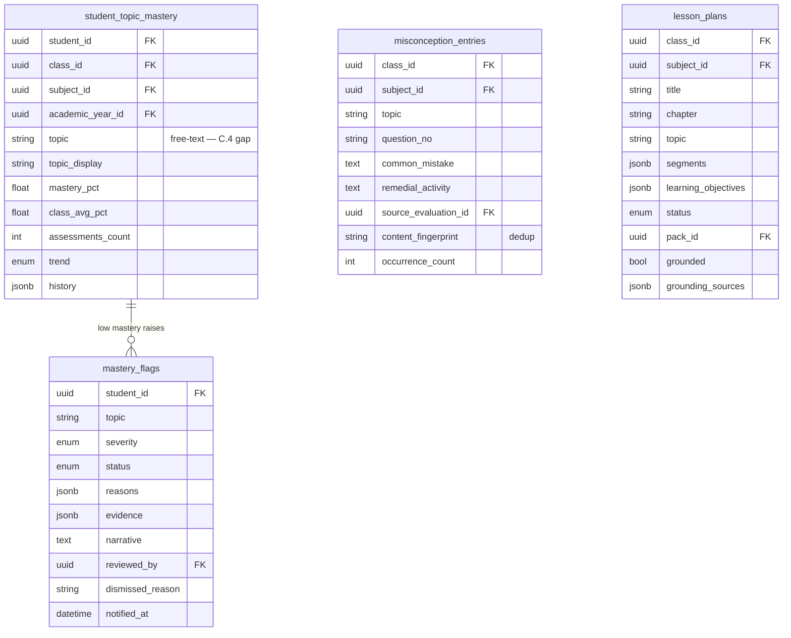
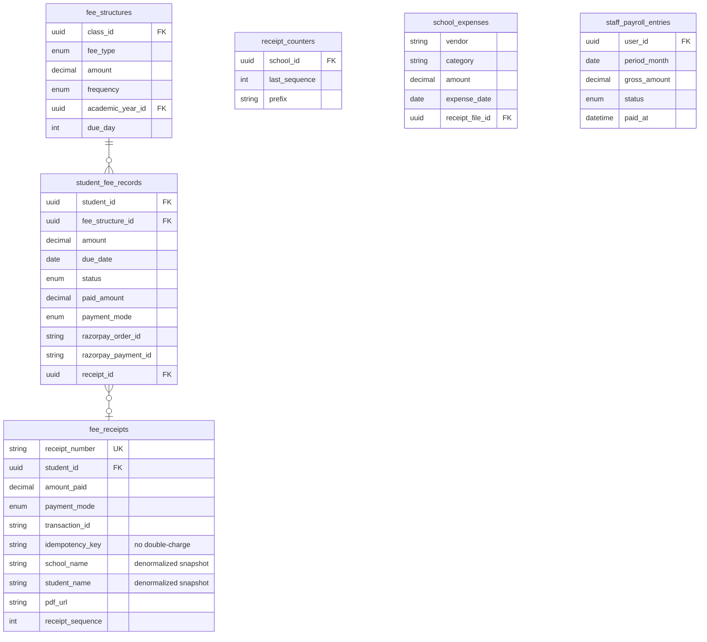
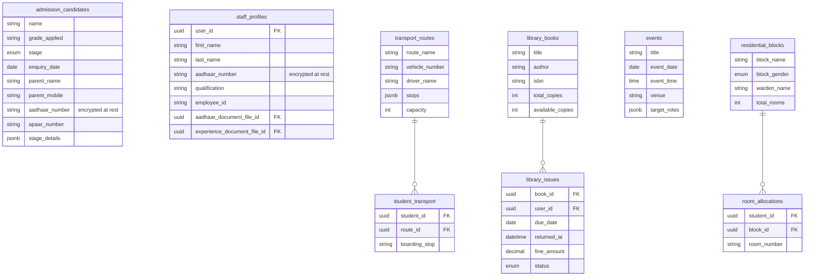
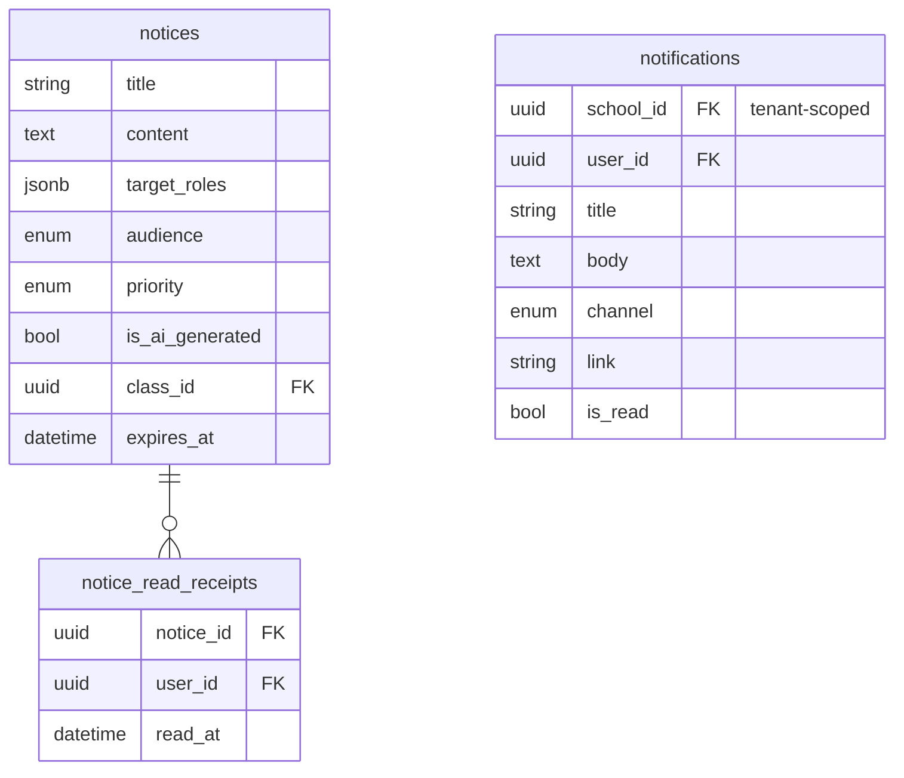
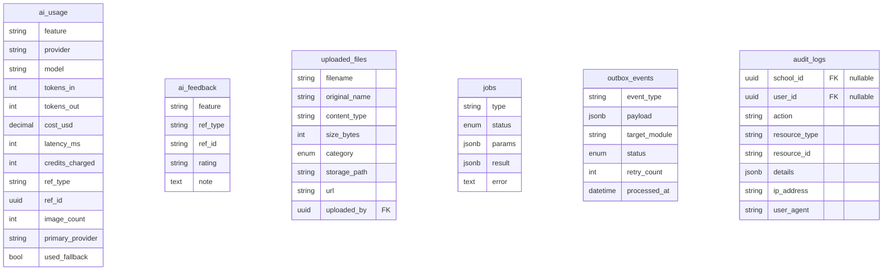

# StudyNexs — Data Model Reference

> **Source of truth:** `apps/api/app/db/models/` (32 model files, ~50 tables).
> Generated from the model layer on 2026-07-30. Regenerate when models change —
> this document describes what exists, not what is planned.
>
> **Base conventions (see Appendix H of the constitution):**
> - Every model inherits `BaseModel`: UUID `id` PK + tz-aware `created_at`/`updated_at`.
> - Every tenant-owned table carries a non-null, indexed `school_id` FK → `schools.id`
>   (omitted from the diagrams below for readability — assume it everywhere).
> - Money is `Numeric`/`Decimal`. Enums are Python `str` enums.

---

## Master overview — the academic loop

The compounding loop the product is built around, as it exists in the schema:

> ⚠ The dotted `exam_marks → student_topic_mastery` edge is the known
> **two-spine gap**: `exams.topic` and `student_topic_mastery.topic` are
> free-text strings joined by title matching, not FKs into
> `curriculum_concepts`. See
> `docs/product/learning-intelligence/TOPIC_ID_MASTERY_SPINE_UNIFICATION_DESIGN_BRIEF.md`.

---

## 1. Tenant & identity

## 2. Academic structure

## 3. Curriculum Intelligence (the grounding spine)

## 4. Assessment & evaluation

## 5. Learning intelligence

## 6. Finance

## 7. School operations

## 8. Communication

## 9. AI platform & plumbing

---

## Design notes (structural read, 2026-07-30)

1. **The compounding loop is fully modeled** — pack → paper → bank items →
   exam → evaluation → misconceptions → mastery → flags → concept cards →
   tutor. The moat exists at schema level, not just in docs.
2. **Known gap (C.4):** `exams.topic` and `student_topic_mastery.topic` are
   free-text strings; the concept spine (`curriculum_concepts`) is joined only
   by title string-matching. Unification design brief exists; Phase A passive
   resolution is certified; deeper persistence (Phase B) is a deferred gate.
3. **HITL is schema-level:** `approved_by/at`, `status`, `teacher_overrides`,
   `rejection_reason` appear consistently on papers, evaluations, packs,
   cards, flags, and content-review items.
4. **Money discipline holds:** all currency columns are `Decimal`; receipts
   carry idempotency keys, per-tenant counters, and denormalized snapshots.
5. **`kg_edges` is a generic any-node → any-node graph table** — the seam for
   PREREQUISITE edges when that work is authorized.
6. **JSONB used pragmatically** (`question_schema`, `sections`, `evidence`,
   `history`, `stage_details`); fields that become query targets at scale
   (e.g. `question_bank_items.topics`) are candidates for promotion to real
   columns.

---

## DM-4 design brief — Subject identity (design-only, 2026-07-31)

Status: **Proposed — implementation folded into Topic-ID/Mastery Spine Phase B.**
No code or migration is authorized by this brief.

### Problem

`subjects` rows are scoped to a single class (`class_id` FK), and classes are
scoped to a single academic year. "Mathematics" therefore fragments into a
distinct row per **section per year**: Grade 8A 2026–27 Mathematics,
Grade 8B 2026–27 Mathematics, and Grade 8A 2027–28 Mathematics are three
unrelated UUIDs. Nine tables key on `subject_id` (packs, exams, mastery,
misconceptions, question bank, papers, lesson plans, timetable, teacher
mappings), so every longitudinal or cross-section question — "how is
Mathematics mastery trending across Grade 8?", "reuse last year's approved
Mathematics items" — currently requires name string-matching, the same defect
class as the free-text topic spine (C.4).

### Proposed shape (expand-then-contract)

1. **Expand:** add a school-scoped `subject_catalog` table
   (`school_id`, `name`, `code`, optional board-subject mapping;
   unique on `(school_id, name)`), and a nullable
   `subjects.catalog_id` FK → `subject_catalog.id`.
2. **Backfill:** normalize existing `subjects.name` values per school
   (trim/case-fold), create one catalog row per distinct name, link every
   subject row. Ambiguities (e.g. "Maths" vs "Mathematics") are surfaced for
   human resolution, never auto-merged.
3. **Dual-write:** subject creation paths set `catalog_id` (creating the
   catalog row on first use). Per-class `subjects` rows remain — they are the
   correct grain for timetable/teacher mapping; the catalog is the identity
   layer above them.
4. **Switch reads:** longitudinal consumers (mastery aggregation, question-bank
   retrieval, pack lineage, analytics) group by `catalog_id` instead of
   name matching.
5. **Contract (much later):** enforce `catalog_id NOT NULL` once all writers
   are dual-writing and the backfill is verified per tenant.

### Why folded into Spine Phase B

The topic spine (`exam.topic` → `topic_id`) and subject identity are the same
disease — string identity where the model needs stable IDs — and share the
same consumers (mastery, retrieval, analytics). Fixing them in one Phase B
batch avoids touching the mastery unique constraints
(`student_id, subject_id, academic_year_id, topic`) twice.

### Risks / open questions for Phase B

- Mastery unique constraints embed `subject_id`; re-keying reads to
  `catalog_id` must not merge mastery rows across sections silently —
  aggregation happens at read time, storage grain stays per-class.
- Cross-year concept mapping (pack versioning) should reference `catalog_id`
  so a book-edition change doesn't orphan subject lineage.
- Tenant-scoped throughout; catalog rows carry `school_id` like every other
  tenant-owned table.
