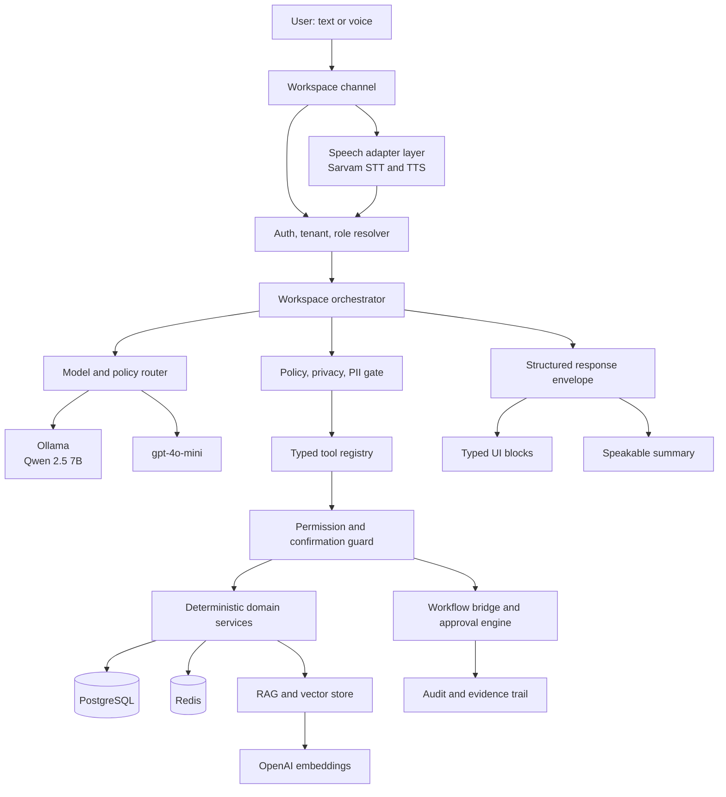

# StudyNexs Local-First Governed Agentic Workspace Implementation Plan

**Status:** Proposed for validation  
**Scope:** Design and implementation blueprint only. No code authorization is implied.  
**Last updated:** 2026-09-04

## 1. Purpose

This document defines the first implementation plan for the StudyNexs conversational academic workspace.

Locked architectural principle for this implementation plan:

```text
Agentic orchestration at the edge.
Deterministic governance at the core.
Structured UI blocks at the presentation layer.
Human approval for consequential academic outcomes.
```

It converts the agreed product direction into an implementation-ready architecture:

- chat for intent
- agents for bounded orchestration
- tools for controlled access
- deterministic domain services for truth
- workflow state for actions
- humans for approval
- structured UI blocks for presentation

This plan is intentionally local-first for orchestration cost control, but not local-only.

## 2. Proposed Baseline Decisions

The following decisions are the current proposed baseline for implementation and must be validated against latency, quality, cost, privacy, and deployment constraints before being treated as permanent platform defaults:

1. Primary local orchestration and conversational model candidate: Qwen 2.5 7B Instruct, quantized, via Ollama.
2. Cloud fallback model candidate: gpt-4o-mini.
3. Embeddings candidate: OpenAI embeddings remain the retrieval provider.
4. Speech layer candidate: Sarvam AI is the proposed STT and TTS provider.
5. Truth boundary: deterministic domain services remain authoritative.
6. Orchestration shape: one orchestrator first, not a swarm or multi-agent mesh.
7. Frontend contract: structured response envelope with typed UI blocks, not markdown-only chat.
8. Approval boundary: consequential actions and authoritative academic outputs require workflow confirmation and human approval.

These four provider choices are intentionally framed as candidates, not irrevocable decisions. The architectural pattern is the real decision; the exact providers must still earn their place operationally.

## 3. Goals

This first implementation should achieve the following:

1. Add a conversational workspace without replacing the current deterministic product surfaces.
2. Let users ask natural-language questions over real school data without turning every query into a model-first workflow.
3. Keep model cost low by routing direct retrieval to tools and deterministic services.
4. Support voice input and output without making speech providers part of business logic.
5. Keep the tenant, RBAC, audit, and approval rules intact.
6. Produce reusable backend and frontend primitives that later portals can consume.

## 4. Non-Goals

The first implementation should explicitly avoid the following:

1. Replacing dashboards, lists, tables, and detail pages with chat.
2. Introducing a second source of truth for academic or operational data.
3. Allowing the orchestrator to query the database directly.
4. Building a multi-agent or swarm architecture in v1.
5. Switching embeddings to local models in the same wave.
6. Letting the model finalize grades, publish artifacts, or execute sensitive actions autonomously.
7. Capturing or retaining raw voice and transcript data broadly by default.

## 5. Product Principles for This Design

The implementation must preserve these rules:

1. The model may explain truth. It may not become truth.
2. Chat is an interface, not a database.
3. Tool outputs are constrained, typed, tenant-scoped, and permission-checked.
4. Structured UI blocks are part of the product contract, not a frontend convenience.
5. Voice is an input and output layer, not the decision engine.
6. The system must degrade safely to deterministic screens and explicit workflow steps.

## 6. Architecture Overview



### 6.1 Mandatory execution path

The governing request path for every workspace turn is:

1. user request
2. auth, tenant, and role context resolution
3. workspace orchestrator
4. policy, privacy, and PII gate
5. typed tool registry
6. permission and confirmation guard
7. deterministic domain services for read and report truth, or workflow bridge and approval engine for guarded action and approval turns

This path is mandatory. It is not an optional safety layer.

### 6.2 Prompt injection and RAG safety

Retrieved documents, user-uploaded content, tool output, and policy text are data, not instructions.

The orchestrator must not follow instructions found inside retrieved content.

Only system-defined orchestration policy and registered tool contracts can control behavior.

This rule applies uniformly to:

1. retrieved curriculum or policy documents
2. user-entered free text
3. uploaded files and OCR output
4. tool output returned from deterministic services
5. any prompt context assembled for local or fallback models

### 6.3 Conditional speech path

Speech is conditional, not universal.

Text requests should go directly through auth, tenant, and role resolution into orchestration.

Audio requests should pass through STT first, then enter the same auth and orchestration path.

That means the speech adapter is only part of the path when the request modality is audio.

## 7. Runtime Interaction Model

Every user request should be classified into one of four modes.

### 7.1 Read Mode

Used when the user wants facts, summaries, or guided explanation over deterministic data.

Examples:

1. Which students are below attendance threshold?
2. Show unpaid fee balances for Class 9.
3. Why is this child marked weak in fractions?

Behavior:

1. resolve intent
2. call read tools
3. optionally summarize or explain with the model
4. return typed UI blocks
5. do not enter workflow approval unless the user requests an action

### 7.2 Draft Mode

Used when the system is preparing user-editable content.

Examples:

1. Draft a parent message
2. Draft a lesson explanation
3. Draft a follow-up note

Behavior:

1. gather deterministic context
2. generate a draft
3. validate structure
4. return a draft preview block
5. do not publish or send automatically

### 7.3 Action Mode

Used when the user is initiating an operation.

Examples:

1. Send this message to the parent
2. Queue evaluation for these sheets
3. Assign follow-up to this teacher

Behavior:

1. interpret request
2. resolve target entities
3. create a workflow request
4. ask for confirmation if needed
5. execute through deterministic workflow handlers only

### 7.4 Approval Mode

Used when the request touches high-trust or institutionally consequential output.

Examples:

1. report-card narrative
2. publish marks
3. finalize paper or evaluation output
4. commit a school-wide communication generated from AI input

Behavior:

1. draft or prepare proposed output
2. attach evidence and citations
3. require explicit reviewer identity and decision
4. persist approval state and audit trail

## 8. Backend Implementation Design

## 8.1 Module Placement

The implementation should be split into two layers.

### User-facing module

Create a new module for the workspace-facing contract:

`apps/api/app/modules/workspace/`

Proposed structure:

```text
modules/workspace/
├── endpoints/
│   ├── conversation.py
│   └── voice.py
├── services/
│   ├── workspace_service.py
│   └── session_service.py
├── schemas/
│   ├── request.py
│   ├── response.py
│   └── blocks.py
└── __init__.py
```

Responsibilities:

1. HTTP routes
2. request validation
3. response envelope contract
4. session entry points
5. role-aware workspace policies at the boundary

### Shared orchestration layer

Add a new shared orchestration package under the AI platform:

`apps/api/app/modules/ai/orchestration/`

Proposed structure:

```text
modules/ai/orchestration/
├── orchestrator.py
├── router.py
├── policies.py
├── tool_registry.py
├── tool_types.py
├── workflow_bridge.py
├── context_builder.py
├── response_builder.py
├── speech_bridge.py
└── __init__.py
```

Responsibilities:

1. classify request mode
2. choose model path
3. decide local-first versus cloud fallback
4. call tools in bounded steps
5. produce typed response objects
6. enforce tool-call and token budgets
7. bridge into workflow and approval systems

This preserves the architectural rule that shared AI capabilities live in the shared platform, while the workspace module owns the user-facing API contract.

## 8.2 Orchestrator Responsibilities

The orchestrator should do exactly the following and nothing broader.

1. Interpret user intent.
2. Resolve request mode: read, draft, action, or approval.
3. Select model route: local-first or cloud fallback.
4. Build a minimal tool plan.
5. Execute only registered tools.
6. Validate returned tool payload shapes.
7. Compose the final structured response.
8. Generate a short speakable summary.
9. Emit telemetry and billing data.
10. Create workflow requests instead of mutating sensitive state directly.

The orchestrator should not:

1. query ORM models directly
2. own business rules for fees, attendance, exams, report cards, or permissions
3. store long-lived academic truth
4. bypass approval policies

## 8.3 Tool Registry Design

All tool access should be typed and explicit.

### Tool classes

1. Read tools
2. Draft tools
3. Action tools

### Read tools

Examples:

1. `get_student_profile`
2. `get_attendance_summary`
3. `get_fee_status`
4. `get_exam_schedule`
5. `get_mastery_flags`
6. `search_question_bank`
7. `get_curriculum_context`

### Draft tools

Examples:

1. `draft_parent_message`
2. `draft_teacher_followup`
3. `draft_tutor_explanation`
4. `draft_principal_summary`

### Action tools

Examples:

1. `create_parent_message_request`
2. `queue_answer_sheet_evaluation`
3. `submit_question_paper_for_review`
4. `create_intervention_task`

### Tool contract

Each tool should define:

1. input schema
2. output schema
3. `read_only`
4. `side_effect_level`
5. `requires_human_confirmation`
6. `idempotency_key_required`
7. allowed role rules
8. school scope rules
9. audit event type
10. `pii_level`
11. `max_payload_size`
12. `tool_result_cache_policy`

The registry must reject any tool that does not declare those fields.

### Tool execution guardrails

The workspace must not hang on one slow or degraded tool.

Each tool execution path should therefore define:

1. timeout budget
2. retry policy
3. circuit breaker behavior
4. partial failure behavior

Rules:

1. read tools may retry once when the call is idempotent and the failure is transient
2. draft tools may retry only when duplicate draft generation is safe and bounded
3. action tools should not blind-retry after timeout unless the workflow layer can prove idempotent handling
4. repeated tool failures should open a circuit breaker for that tool and force graceful degradation
5. tool timeouts must surface a structured warning or error block rather than stall the entire workspace turn
6. fallback to a model must not hide deterministic tool failure when the user needs verified facts

### Tool contract notes

The explicit metadata above prevents tools from quietly becoming hidden business logic or hidden mutation paths. Side effects, idempotency, approval, and PII classification must be visible at registration time, not inferred later.

The registry must also be deny-by-default. If role scope, tenant scope, confirmation requirement, PII classification, or cache policy is missing or invalid, the tool must not run.

## 8.4 Deterministic Service Boundary

Each tool must wrap an existing or new deterministic domain service.

Examples:

1. attendance tools call attendance services
2. fee tools call fee services
3. student tools call school or portal services
4. curriculum tools call curriculum or RAG services
5. action tools call explicit workflow handlers

The tool layer is therefore an adaptation layer, not a new business logic layer.

## 8.5 Model Router Design

The router should operate by policy, not by ad hoc prompt behavior.

### Primary path

Use Qwen 2.5 7B via Ollama when:

1. intent classification is lightweight
2. the task is conversational or explanatory
3. the response requires short synthesis over deterministic data
4. the context size is within local budget
5. the task does not require premium consistency

### Fallback path

Use gpt-4o-mini when:

1. local model times out
2. structured response generation fails validation
3. tool plan is unstable or ambiguous
4. context exceeds local limits
5. the task is schema-sensitive
6. the task is high-trust or approval-sensitive
7. the request has already failed once locally

### Cloud routing privacy rule

Cloud fallback must receive minimized context by default.

That means the fallback path should prefer:

1. redacted identifiers over full sensitive fields
2. compact tool summaries over raw payloads
3. citation references over full retained transcript context

Sensitive or role-restricted context should only be sent to the fallback model when school policy, role policy, and task policy explicitly allow it.

If policy does not allow the required sensitive context to leave the local path, the system must degrade to a deterministic or local-only response instead of silently broadening disclosure.

### No-model path

Do not call a model when:

1. the request is a direct record retrieval that can be rendered from tool output alone
2. the frontend already has a deterministic surface better suited for the task
3. the request is a workflow state mutation with no explanatory value

### Limits

The router should enforce:

1. max tool calls per turn
2. max model calls per turn
3. max local retry count
4. max token budget per turn
5. max response size per block payload

## 8.6 Response Envelope Design

The frontend contract must be structured from day one.

### Response shape

```json
{
  "schema_version": "workspace.response.v1",
  "request_id": "uuid",
  "correlation_id": "uuid-or-trace-id",
  "mode": "read",
  "message": {
    "title": "Attendance risk for Aarav",
    "summary": "Aarav is below the minimum attendance threshold in Science and Maths.",
    "tone": "informative"
  },
  "blocks": [],
  "citations": [],
  "actions": [],
  "verification": {
    "status": "verified",
    "checked_at": "2026-09-04T10:15:00Z",
    "source_systems": ["attendance_service"]
  },
  "warnings": [],
  "errors": [],
  "approval": {
    "required": false,
    "reason": null
  },
  "data_retention": {
    "retention_class": "ephemeral"
  },
  "speech": {
    "speakable_summary": "Aarav is below attendance threshold in Science and Maths.",
    "language": "en-IN"
  },
  "telemetry": {
    "used_model": "qwen2.5:7b",
    "used_fallback": false,
    "tool_calls": 2
  }
}
```

### Core fields

1. `schema_version`
2. `request_id`
3. `correlation_id`
4. `mode`
5. `message`
6. `blocks`
7. `citations`
8. `actions`
9. `verification`
10. `warnings`
11. `errors`
12. `approval`
13. `data_retention`
14. `speech`
15. `telemetry`

### Response contract versioning

The response envelope must include a stable schema identifier from the first release onward.

Initial value:

1. `workspace.response.v1`

New block types or envelope changes must evolve through explicit contract versioning so the frontend can remain stable while backend behavior expands.

### Observability identifiers

The response envelope should always include a user-visible `request_id` and a cross-system `correlation_id` or `trace_id` so one interaction can be traced across frontend logs, orchestrator telemetry, tool execution, deterministic services, and workflow actions.

### Verification states

The response envelope should allow the frontend to show trust state explicitly. The initial verification states should be:

1. `verified`
2. `stale`
3. `missing`
4. `conflicting`
5. `requires_approval`

### Block types for v1

Keep the block vocabulary intentionally narrow:

1. `notice`
2. `metric_row`
3. `table`
4. `student_card`
5. `teacher_card`
6. `timeline`
7. `citation_list`
8. `action_list`
9. `draft_preview`
10. `approval_card`
11. `error_state`

The block set should expand only after real reuse is proven.

## 8.7 Session and Persistence Design

Conversation state should be intentionally small.

### Proposed tables

1. `workspace_sessions`
2. `workspace_turns`
3. `workspace_action_requests`

### `workspace_sessions`

Purpose:

1. identify session owner
2. store tenant and role context
3. store lightweight session metadata

Suggested fields:

1. `id`
2. `school_id`
3. `user_id`
4. `channel` as text or voice
5. `portal` as teacher, parent, student, principal, admin
6. `last_context_entity_type`
7. `last_context_entity_id`
8. `state_summary` as compact JSONB
9. timestamps

### `workspace_turns`

Purpose:

1. audit requests and responses
2. replay failures
3. inspect telemetry

This table is the largest privacy risk in the design and therefore must be intentionally minimized.

Suggested fields:

1. `id`
2. `session_id`
3. `actor` as user or system
4. `input_modality` as text or voice
5. `input_text_redacted`
6. `speech_summary_redacted`
7. `response_mode`
8. `used_provider`
9. `used_model`
10. `used_fallback`
11. `tool_trace` as JSONB with tool names, target IDs, and bounded audit-safe metadata only
12. `approval_required`
13. `retention_class`
14. `contains_sensitive_data`
15. `encrypted_payload_ref` or equivalent nullable pointer when retention is explicitly justified
16. timestamps

The design should not persist raw user text, raw transcript text, or full sensitive tool payloads by default.

### `workspace_action_requests`

Purpose:

1. bridge orchestration to deterministic workflows
2. preserve approval state
3. prevent the chat layer from becoming a mutation engine

Suggested fields:

1. `id`
2. `school_id`
3. `requested_by`
4. `action_type`
5. `idempotency_key`
6. `payload`
7. `status`
8. `requires_confirmation`
9. `requires_approval`
10. `approved_by`
11. timestamps

Action requests must enforce duplicate-submit protection. Idempotency is not only a tool metadata concern; it must exist on the persisted workflow request record itself.

### Retention policy

Default design should be privacy-protective:

1. raw audio should be ephemeral by default
2. transcript persistence should be optional, not default
3. retained transcript fields must be redacted before persistence
4. sensitive retained content should be encrypted if retention is explicitly justified
5. every turn should carry a retention class
6. logs must never contain raw sensitive transcripts or generated academic content beyond a bounded fingerprint

### Retention classes

The initial retention classes should be:

1. `ephemeral`
2. `audit`
3. `support_case`

Only `audit` and `support_case` should permit extended retention, and even then only for redacted or encrypted fields.

## 8.8 Workflow and Approval Bridge

The workspace layer should not directly perform sensitive actions. It should create workflow requests.

Examples:

1. message send request
2. report note approval request
3. evaluation submission request
4. intervention assignment request

This can initially be implemented as a deterministic workflow bridge inside the API, then expanded later if broader workflow infrastructure is required.

All workflow-bound actions must still pass through the permission and confirmation guard before they reach workflow execution or approval handling.

## 8.9 Speech Bridge

Speech should be handled as provider adapters, parallel to the AI gateway style.

Proposed package:

`apps/api/app/modules/ai/speech/`

```text
modules/ai/speech/
├── base.py
├── sarvam.py
├── factory.py
├── service.py
└── __init__.py
```

Responsibilities:

1. STT: audio to transcript
2. TTS: speakable summary to audio
3. provider abstraction
4. timeout and safe error handling
5. voice telemetry

Important rule:

The speech service should return transcript text and audio artifacts only. It should not decide orchestration behavior.

It is only invoked for audio requests or when the response explicitly asks for speech playback. Text-only requests should bypass the speech adapter entirely.

## 8.10 Environment Contract

Proposed environment keys for the first implementation:

```env
AI_DEFAULT_PROVIDER=ollama
AI_DEFAULT_MODEL=qwen2.5:7b
OLLAMA_BASE_URL=http://<ollama-host>:11434
OLLAMA_MODEL=qwen2.5:7b

AI_FALLBACK_PROVIDER=openai
AI_FALLBACK_MODEL=gpt-4o-mini
OPENAI_API_KEY=<secret>

EMBEDDING_PROVIDER=openai
EMBEDDING_MODEL=text-embedding-3-small

SARVAM_ENABLED=true
SARVAM_BASE_URL=<provider-base-url>
SARVAM_API_KEY=<secret>
SARVAM_STT_ENABLED=true
SARVAM_TTS_ENABLED=true
SARVAM_STT_MODEL=<provider-model-name>
SARVAM_TTS_VOICE=<provider-voice-name>
SARVAM_DEFAULT_LANGUAGE=en-IN

WORKSPACE_ORCHESTRATION_ENABLED=false
WORKSPACE_MAX_TOOL_CALLS_PER_TURN=4
WORKSPACE_MAX_MODEL_CALLS_PER_TURN=2
WORKSPACE_MAX_LOCAL_RETRY_COUNT=1
WORKSPACE_TOOL_TIMEOUT_MS=2500
WORKSPACE_TOOL_READ_RETRY_COUNT=1
WORKSPACE_TOOL_CIRCUIT_BREAKER_THRESHOLD=3
WORKSPACE_TOOL_CIRCUIT_BREAKER_COOLDOWN_SECONDS=60
WORKSPACE_MAX_INPUT_CHARS=6000
WORKSPACE_TRANSCRIPT_RETENTION_DAYS=0
WORKSPACE_AUDIO_RETENTION_HOURS=0
WORKSPACE_VOICE_ENABLED=false
WORKSPACE_ACTION_TOOLS_ENABLED=false
WORKSPACE_CLOUD_FALLBACK_ENABLED=true
WORKSPACE_MODEL_ROUTING_ENABLED=true
```

These keys are the proposed internal contract. Provider-specific values should be validated during adapter implementation.

## 8.11 Rollout and kill switch controls

Workspace rollout must be controlled, reversible, and scoped.

### Scoped enablement

Workspace should be enabled per school, per portal, and per role.

That means the system must support:

1. school-level enablement
2. portal-level enablement
3. role-level enablement
4. capability-level enablement for voice and action flows

### Global kill switches

There must be global kill switches for:

1. model routing
2. voice input and output
3. action tools
4. cloud fallback

The orchestration layer must degrade cleanly when any of these are disabled. Read-only deterministic flows must remain usable even if model routing is globally disabled.

## 8.12 Audit event minimum shape

Every action tool, approval transition, and denied, failed, timed-out, or policy-blocked tool attempt must emit a structured audit event with, at minimum:

1. actor
2. school
3. role
4. action
5. target entity
6. before state when relevant
7. after state when relevant
8. source tool
9. request ID
10. correlation ID
11. timestamp

This keeps the workspace auditable as a governed orchestration layer rather than a hidden mutation surface.

The audit surface must therefore cover:

1. successful action execution
2. successful approval transitions
3. denied tool attempts
4. policy-blocked tool attempts
5. timed-out tool attempts
6. failed tool attempts with bounded failure metadata

## 9. Frontend Implementation Design

## 9.1 Frontend Placement

The frontend should introduce a reusable workspace feature set inside the existing web app.

Proposed structure:

```text
apps/admin-web/src/components/workspace/
├── WorkspaceShell.tsx
├── WorkspaceComposer.tsx
├── WorkspaceTranscript.tsx
├── WorkspaceBlockRenderer.tsx
├── blocks/
│   ├── NoticeBlock.tsx
│   ├── MetricRowBlock.tsx
│   ├── TableBlock.tsx
│   ├── StudentCardBlock.tsx
│   ├── ActionListBlock.tsx
│   ├── DraftPreviewBlock.tsx
│   └── ApprovalCardBlock.tsx
└── voice/
    ├── VoiceInputButton.tsx
    ├── VoicePlaybackButton.tsx
    └── VoiceStatusChip.tsx
```

Add shared types under:

`apps/admin-web/src/lib/workspace-types.ts`

## 9.2 Frontend Behavior

The frontend should:

1. render typed blocks from the backend contract
2. preserve a transcript-style interaction history
3. allow user follow-up prompts in the same session
4. trigger classical navigation when a block action maps to an existing page
5. surface confirmation and approval cards as first-class UI
6. support voice capture and voice playback as optional layers

The frontend should not:

1. reconstruct business logic from raw text
2. parse markdown to infer actions
3. trust client-side hidden actions or role assumptions

## 9.3 Workspace UI Pattern

The workspace should feel like an academic work surface, not a generic chatbot.

Recommended layout:

1. left or top contextual panel for current student, class, or task focus
2. central conversational transcript with structured cards
3. inline citations and evidence chips
4. explicit action tray for next steps
5. optional audio playback controls only on messages that provide a speakable summary

The workspace should always keep deterministic navigation available. The user must be able to open the underlying student, fee, attendance, or evaluation screen from the conversational view.

## 9.4 Voice UX Rules

Voice support should remain narrow in v1.

1. capture speech only after explicit user action
2. show recording state clearly
3. render transcribed text before execution where feasible
4. speak only the short final answer, not dense tables or raw citations
5. allow mute or text-only mode everywhere

## 10. Security, Privacy, and Compliance

The implementation must preserve the existing platform rules.

1. Every workspace request derives tenant and role from authenticated backend context.
2. All tool calls remain tenant-scoped and permission-checked.
3. No client-supplied school identifier is trusted.
4. Raw audio and transcripts are treated as sensitive input.
5. Raw model output and raw transcripts must not be written to logs.
6. Action tools must emit audit events.
7. Approval decisions must preserve reviewer identity and timestamps.
8. Tool execution is deny-by-default when scope, confirmation, PII, or audit metadata is absent.

## 11. Cost and Performance Policy

This design is meant to control cost structurally.

### Cost principles

1. direct retrieval should stay deterministic whenever possible
2. local Qwen should absorb low-cost daily conversation
3. cloud fallback should be reserved for failure, ambiguity, and higher-consistency needs
4. embeddings remain stable and predictable on OpenAI
5. speech cost should be measured separately from orchestration cost

### Performance targets

For the first voice-enabled version, target:

1. STT under 3 seconds for short clips
2. local orchestration under 3 seconds for normal read mode requests
3. tool execution under 1 second on common read paths
4. TTS under 2 seconds for short answers
5. full voice roundtrip under 8 seconds on the happy path

These are targets, not guarantees, but they should drive routing and fallback policy.

## 12. Implementation Phases

Implementation should be staged deliberately.

### Phase 0: Architecture contract

Deliverables:

1. approved implementation document
2. confirmed model and provider decisions
3. final first-surface selection
4. final transcript retention policy

### Phase 1: Text-only workspace backend contract

Deliverables:

1. workspace module scaffolding
2. orchestration package scaffolding
3. response schemas
4. router and policy skeleton
5. one read-only conversation endpoint

This phase should be the first implementation slice. Voice, draft mutation paths, and approval-heavy flows should not begin until text-only read mode proves the core contract.

Suggested first flow:

1. teacher copilot read mode
2. parent ask read mode

### Phase 2: Read tools and structured UI blocks

Deliverables:

1. initial tool registry
2. attendance, fees, student, mastery, and curriculum read tools
3. frontend block renderer
4. citations and action lists

### Phase 3: Draft and action flows

Deliverables:

1. draft tools
2. workflow action requests
3. confirmation cards
4. approval cards

### Phase 4: Voice support

Deliverables:

1. Sarvam speech adapter
2. voice endpoints
3. frontend voice capture and playback controls
4. speakable summary generation

### Phase 5: Higher-trust academic workflows

Deliverables:

1. governed academic draft flows
2. approval state integration
3. stronger evidence and audit surfacing
4. fallback rules for high-trust tasks

### Phase 6: Operational hardening

Deliverables:

1. telemetry dashboards
2. turn-level metering
3. per-feature quotas
4. failure drills and regression tests

## 13. Testing and Validation Plan

No issue should be marked complete in this implementation without tests that prove the behavioral contract.

### Backend tests

1. tenant isolation for workspace tool calls
2. role-gated access per tool
3. router decisions for local, fallback, and no-model paths
4. response schema validation
5. workflow approval enforcement
6. speech adapter failure handling
7. raw transcript and raw output log-safety tests

### Golden evaluation dataset

Before shipping, the workspace must have a golden evaluation dataset that measures agentic behavior instead of relying on informal judgment.

The initial dataset must cover:

1. intent classification
2. mode routing
3. tool selection
4. no-model report routing
5. permission denial
6. hallucination prevention
7. structured block validity

The dataset should be used for:

1. local model evaluation
2. fallback model evaluation
3. router regression checks
4. prompt or policy regression detection
5. acceptance gating before rollout expansion

### Frontend tests

1. block rendering by type
2. action and approval flows
3. text-only fallback behavior
4. voice control state handling
5. accessibility for transcript, controls, and cards

### End-to-end tests

1. read mode question over real deterministic data
2. draft mode message creation
3. action mode workflow request
4. approval mode review gate
5. local-model timeout leading to cloud fallback
6. voice input to structured response to speech playback

## 14. Initial Acceptance Criteria

The first approved slice should not ship unless all of these hold.

1. A user can ask a natural-language question and receive a structured response with citations.
2. Deterministic facts come from tools and services, not hallucinated free text.
3. A direct deterministic report request can complete with zero model calls.
4. The system can render a response without relying on markdown parsing.
5. Local Qwen is the normal path for low-stakes conversational requests.
6. gpt-4o-mini fallback works when local handling fails or policy requires stronger consistency.
7. Voice support, if enabled in the slice, is fully optional and degrades cleanly.
8. Action requests are workflow-mediated, idempotent, and audited.
9. No sensitive action can be silently completed from chat.

## 15. Risks and Mitigations

### Risk 1: The workspace becomes a second UI for everything

Mitigation:

1. keep traditional screens
2. restrict chat to intent, explanation, and workflow guidance
3. route back into existing screens when appropriate

### Risk 2: Local model latency on Oracle always-free degrades experience

Mitigation:

1. keep Qwen usage narrow
2. cap context size
3. use fast fallback to gpt-4o-mini
4. do not colocate too many heavy workloads without measurement

### Risk 3: Tool payloads become too large and make local inference unstable

Mitigation:

1. return compact typed tool outputs
2. summarize structured payloads before model use
3. hard-cap payload sizes

### Risk 4: Voice data expands privacy surface area

Mitigation:

1. ephemeral raw audio by default
2. minimal transcript retention
3. no raw transcript logging
4. explicit user action for capture

### Risk 5: Structured block design grows uncontrolled

Mitigation:

1. keep a small v1 block vocabulary
2. add new blocks only when reused
3. reject one-off block inventions inside feature code

## 16. Validation Questions for ARM

The following decisions should be explicitly validated before implementation begins.

1. Confirm `gpt-4o-mini` as the first production fallback instead of benchmarking Gemini Flash first.
2. Confirm transcript policy: ephemeral by default, or retained for a bounded period.
3. Confirm the first workspace surface: teacher, parent, student, or principal.
4. Confirm whether voice is in the first delivery slice or follows after text-only stabilization.
5. Confirm whether workspace sessions need durable history in v1 or can start as short-lived session state.

## 17. Recommended Approval Outcome

Recommended status for this document:

1. approved directionally
2. ready for Phase 0 validation
3. not yet authorized for implementation until ARM confirms provider choices, first surface, transcript retention, and voice timing

My recommendation is to approve the following as the initial implementation direction:

1. one orchestrator only
2. local-first Qwen orchestration
3. gpt-4o-mini fallback
4. OpenAI embeddings unchanged
5. Sarvam speech adapters
6. structured response envelope
7. read-first rollout before action and approval heavy flows

That sequence gives StudyNexs the conversational workspace it wants without collapsing the platform into an ungoverned chatbot architecture.

Recommended first slice:

1. text-only read mode
2. one deterministic report flow
3. structured response envelope
4. zero-model direct retrieval path

Recommended first surface:

1. teacher copilot read mode first
2. parent ask read mode as the alternative first rollout
3. do not start with student or admin action-heavy flows