# StudyNexs Product Blueprint

**Purpose:** Canonical product definition of StudyNexs.

This document defines what StudyNexs is, which personas it serves, how the full school lifecycle works inside the product, which intelligence domains compose the operating system, and what the current Release 0.3.1 product can honestly demonstrate.

This is a stable, vision-level product blueprint. It does **not** define implementation order, sprint tasks, estimates, release scope, or engineering authorization.

---

## 1. What StudyNexs Is

StudyNexs is an AI-first School Operating System.

It is not a generic ERP, not just an LMS, and not a chatbot. Its core product idea is:

> StudyNexs learns a school’s curriculum first, then helps teachers teach, assess, evaluate, remediate, communicate, and lead with humans always in control.

StudyNexs becomes valuable when a school can trust that:

- academic content is grounded in an approved school curriculum;
- teachers and academic leads remain the authority;
- assessment evidence updates mastery;
- students receive personalized remediation;
- parents receive clear, safe explanations;
- principals and management see the school as one connected operating system.

The product should feel premium, calm, trustworthy, modern, intelligent, cohesive, and human. AI should feel like a trusted assistant inside the school operating rhythm, not like the product has become a gimmick.

---

## 2. Complete School Operating System Journey

The complete StudyNexs journey runs from admission to alumni.

```mermaid
flowchart LR
  A["Admissions inquiry"] --> B["Student enrollment"]
  B --> C["Student profile + guardians"]
  C --> D["Class, subject, teacher assignment"]
  D --> E["Curriculum source upload"]
  E --> F["AI extracts CurriculumPack"]
  F --> G["Teacher / HOD review"]
  G --> H["Approve CurriculumPack"]
  H --> I["KG + RAG ready"]
  I --> J["Teacher planning"]
  J --> K["Lesson plan + learning material"]
  K --> L["Question paper"]
  L --> M["Exam conducted"]
  M --> N["Answer sheet upload"]
  N --> O["AI evaluation suggestions"]
  O --> P["Teacher approval"]
  P --> Q["Marks + gradebook"]
  Q --> R["Mastery update"]
  R --> S["Student tutor / remediation"]
  R --> T["Parent briefing"]
  R --> U["Principal insight"]
  U --> V["School operating decisions"]
  V --> W["Progression / promotion"]
  W --> X["Alumni record"]
```

### Journey narrative

1. A family enters the admissions pipeline.
2. The school enrolls the student and creates the academic, operational, and guardian record.
3. Classes, subjects, teachers, timetable, transport, fees, and other operating data are connected.
4. The school teaches StudyNexs its curriculum through a curriculum source.
5. AI proposes a structured CurriculumPack.
6. A teacher, HOD, class incharge, or academic lead reviews and approves the pack.
7. StudyNexs builds academic memory through KG and RAG.
8. Teachers generate grounded lesson plans, materials, and question papers.
9. Assessments are conducted.
10. Answer sheets are uploaded.
11. AI produces evaluation suggestions.
12. Teachers review and approve marks.
13. Marks update gradebook and mastery.
14. Students receive personalized learning support.
15. Parents receive trusted, plain-language learning guidance.
16. Principals see academic and operational signals in one operating view.
17. Management sees institutional progress, risks, adoption, and value.
18. Over time, the student record becomes a continuous academic history through graduation and alumni.

---

## 3. Persona Journey Map

| Persona | Product role | Primary questions StudyNexs must answer | Canonical journey |
|---|---|---|---|
| Management / Trustees | Institution-level owner | Is the school improving? Is StudyNexs worth investing in? Are risks visible? | View institution health, principal confidence, teacher adoption, academic outcomes, financial/operational indicators, and pilot ROI. |
| Principal | Academic and operational leader | Is the school academically ready? Are teachers using the system? Where should I intervene? | Confirm Academic Intelligence readiness, review curriculum grounding, observe teacher outputs, monitor school indicators, and make weekly operating decisions. |
| Admin Staff | Operational backbone | Can I run daily school administration without chaos? | Manage admissions, students, staff, fees, payroll, transport, library, residential, events, notices, settings, and records. |
| Teacher | Main academic operator | Will this save preparation and assessment time while keeping me in control? | Build/review curriculum, approve academic structure where authorized, generate lesson plans/materials/question papers, conduct assessments, review AI evaluation, approve marks, and trigger remediation. |
| Student | Learner | What should I learn next, and why? | See mastery, weak topics, recommended learning activity, tutor support, notices, and personal academic progress. |
| Parent | Supporter at home | How is my child doing, and how can I help safely? | View child summary, fees/notices, weak topics, teacher-approved progress, parent briefing, and home support suggestions. |

---

## 4. Intelligence Domain Map

StudyNexs should be understood as a set of connected intelligence domains, not a loose collection of modules.

| Intelligence domain | Purpose | Major capabilities | Release 0.3.1 state |
|---|---|---|---|
| Admissions Intelligence | Convert inquiry to enrolled student | Pipeline, document extraction, stage tracking, readiness | Partially implemented |
| Student Records Intelligence | Maintain complete learner identity | Profile, class, guardians, history, documents | Partially implemented |
| Curriculum Intelligence | Create approved academic memory | CurriculumPack, HITL review, approval, KG, RAG, readiness | Already implemented |
| Teaching Intelligence | Help teachers prepare | Lesson plans, learning materials, teacher workspace, pack grounding | Already implemented / partial |
| Assessment Authoring Intelligence | Help teachers create assessments | AI question papers, citations, review, approval, exam creation | Already implemented / partial |
| Assessment Evaluation Intelligence | Help evaluate student work | Answer-sheet upload, OCR/vision, scoring suggestions, teacher approval | Partially implemented |
| Learning Intelligence | Convert marks into mastery | Gradebook, mastery, misconceptions, weak topics | Partially implemented |
| Student Intelligence | Guide the learner | Tutor, recommendations, concept-card lessons, student copilot | Partially implemented |
| Parent Intelligence | Explain progress at home | Parent briefing, child summary, home tips, parent ask | Partially implemented |
| Principal Intelligence | Give leadership operating clarity | Dashboard, readiness, grounding evidence, school priorities | Partially implemented |
| School Operations Intelligence | Run daily school operations | Attendance, timetable, notices, events, transport, library, fees, payroll, expenses | Partially implemented |
| Staff Intelligence | Manage staff lifecycle | Staff directory, onboarding, payroll, teacher mappings | Partially implemented |
| Finance Intelligence | Track money flows | Fees, receipts, expenses, payroll, finance summaries | Partially implemented |
| Alumni Intelligence | Maintain post-school relationship | Graduate history, alumni profile, outcomes | Not implemented |

---

## 5. Capability Matrix

| Domain | Capability | Status |
|---|---|---|
| Admissions Intelligence | Admission candidate pipeline | Partially implemented |
| Admissions Intelligence | Admission stage movement | Partially implemented |
| Admissions Intelligence | Admission document number extraction | Partially implemented |
| Admissions Intelligence | Admission-to-student conversion | Partially implemented |
| Admissions Intelligence | AI admission readiness / fit summary | Not implemented |
| Student Records Intelligence | Student list/profile | Already implemented |
| Student Records Intelligence | Guardian/parent links | Partially implemented |
| Student Records Intelligence | Academic-year/class/section assignment | Already implemented |
| Student Records Intelligence | Longitudinal student history | Partially implemented |
| Student Records Intelligence | Promotion/graduation/alumni transition | Not implemented |
| Curriculum Intelligence | Curriculum source upload/paste | Already implemented |
| Curriculum Intelligence | AI extraction to draft CurriculumPack | Already implemented |
| Curriculum Intelligence | Teacher/HOD review | Already implemented |
| Curriculum Intelligence | CurriculumPack approval | Already implemented |
| Curriculum Intelligence | KG spine generation | Already implemented |
| Curriculum Intelligence | RAG indexing | Already implemented |
| Curriculum Intelligence | Academic Intelligence Ready status | Already implemented |
| Teaching Intelligence | Teacher teaching hub | Already implemented |
| Teaching Intelligence | Grounded lesson plans | Already implemented |
| Teaching Intelligence | Learning materials from same pack | Partially implemented |
| Teaching Intelligence | Teacher class/subject scoping | Already implemented |
| Teaching Intelligence | Teacher content review queue | Partially implemented |
| Assessment Authoring Intelligence | AI question paper generation | Already implemented |
| Assessment Authoring Intelligence | Question citations / grounding | Already implemented |
| Assessment Authoring Intelligence | Question paper review/approve | Partially implemented |
| Assessment Authoring Intelligence | Exam creation from question paper | Partially implemented |
| Assessment Evaluation Intelligence | Answer-sheet upload | Partially implemented |
| Assessment Evaluation Intelligence | OCR / vision extraction | Partially implemented |
| Assessment Evaluation Intelligence | AI scoring suggestions | Partially implemented |
| Assessment Evaluation Intelligence | Teacher HITL approval | Partially implemented |
| Assessment Evaluation Intelligence | Marks saved to gradebook | Partially implemented |
| Learning Intelligence | Gradebook | Partially implemented |
| Learning Intelligence | Mastery recomputation | Partially implemented |
| Learning Intelligence | Misconception tracking | Partially implemented |
| Learning Intelligence | Class-level weak-topic summary | Partially implemented |
| Student Intelligence | Student portal | Partially implemented |
| Student Intelligence | AI Tutor recommendations | Partially implemented |
| Student Intelligence | Concept-card grounded lesson | Partially implemented |
| Student Intelligence | Personalized next activity | Partially implemented |
| Parent Intelligence | Parent portal | Partially implemented |
| Parent Intelligence | Child summary/progress | Partially implemented |
| Parent Intelligence | Parent Copilot briefing | Partially implemented |
| Parent Intelligence | Parent home support suggestions | Partially implemented |
| Principal Intelligence | Principal dashboard | Already implemented |
| Principal Intelligence | Academic readiness visibility | Already implemented |
| Principal Intelligence | Grounding evidence visibility | Already implemented |
| Principal Intelligence | Weekly operating rhythm | Partially implemented |
| School Operations Intelligence | Attendance | Partially implemented |
| School Operations Intelligence | Timetable | Partially implemented |
| School Operations Intelligence | Notices | Partially implemented |
| School Operations Intelligence | Events | Partially implemented |
| School Operations Intelligence | Transport | Partially implemented |
| School Operations Intelligence | Library | Partially implemented |
| School Operations Intelligence | Residential/hostel | Partially implemented |
| Staff Intelligence | Staff directory | Partially implemented |
| Staff Intelligence | Staff onboarding | Partially implemented |
| Staff Intelligence | Payroll | Partially implemented |
| Finance Intelligence | Fees | Partially implemented |
| Finance Intelligence | Receipts | Partially implemented |
| Finance Intelligence | Expenses | Partially implemented |
| Finance Intelligence | Management finance intelligence | Partially implemented |
| Alumni Intelligence | Alumni records | Not implemented |
| Alumni Intelligence | Alumni outcomes / engagement | Not implemented |

---

## 6. Gap Analysis Against Release 0.3.1

### What Release 0.3.1 can honestly demonstrate well

- Principal login and dashboard.
- Academic Intelligence Ready.
- Approved CurriculumPack as academic memory.
- KG/RAG readiness.
- Teacher class/subject scoping.
- Grounded lesson plan generation.
- Grounded question paper generation.
- Same-pack grounding evidence.
- Human-in-the-loop curriculum approval.
- AI credits and emergency override control.
- Principal + Teacher browser walkthrough without console/API errors.
- `/api/v1/ops/events` certification patch in `v0.3.1`.

This is the strongest executive story today.

### What exists but should be shown carefully

- Student Tutor.
- Student Copilot.
- Parent Copilot.
- Parent portal.
- Assessment evaluation.
- Answer-sheet OCR/vision.
- Mastery updates.
- Gradebook.
- Admissions.
- Fees.
- Payroll.
- Transport.
- Library.
- Events.
- Notices.

These are real surfaces, but they are not yet as narratively complete or certified as the Principal + Teacher journey.

### What is missing for the complete School Operating System vision

- One seamless admission-to-enrollment journey.
- One complete admin setup journey.
- A polished full assessment browser journey from exam creation to approved marks.
- Complete student remediation journey visible end-to-end.
- Complete parent communication journey with teacher control.
- Principal weekly operating rhythm.
- Management/trustee-level executive view.
- Alumni lifecycle.
- Full operational intelligence across finance, HR, transport, library, attendance, and academics as one connected system.

---

## 7. Executive Narrative

For leadership, the complete StudyNexs demonstration should eventually tell this story:

1. Management sees the institution operating from one trusted system.
2. Principal sees school health and Academic Intelligence readiness.
3. Admin staff manage admissions, students, staff, fees, events, transport, and records.
4. Teacher teaches StudyNexs the school curriculum.
5. Teacher/HOD approves the CurriculumPack.
6. StudyNexs builds KG/RAG academic memory.
7. Teacher generates grounded lesson plans and question papers.
8. Teacher conducts assessment.
9. AI evaluates answer sheets, but teacher approves marks.
10. Marks update gradebook and mastery.
11. Student receives personalized remediation.
12. Parent receives clear, safe, school-approved learning guidance.
13. Principal sees academic risks, teacher activity, and intervention signals.
14. Over years, the student record becomes a continuous learning history through graduation and alumni.

That is the full School Operating System vision.

Release 0.3.1 proves the center of that story: approved curriculum memory grounding teacher workflows. The remaining gaps are about making the surrounding school lifecycle equally complete, connected, and demonstrable.

---

## 8. Stability Rule

This Product Blueprint should remain stable. It may evolve only when:

- real pilot evidence shows that the product definition is wrong or incomplete;
- ARM explicitly requests product-blueprint revision;
- the product vision changes deliberately.

It should not be edited for routine implementation planning, release planning, sprint execution, or engineering task tracking.
