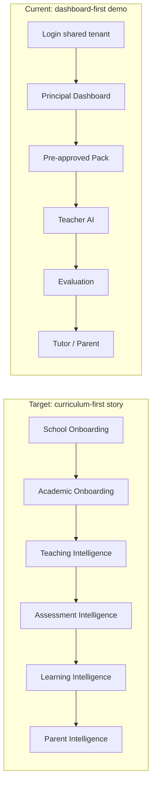
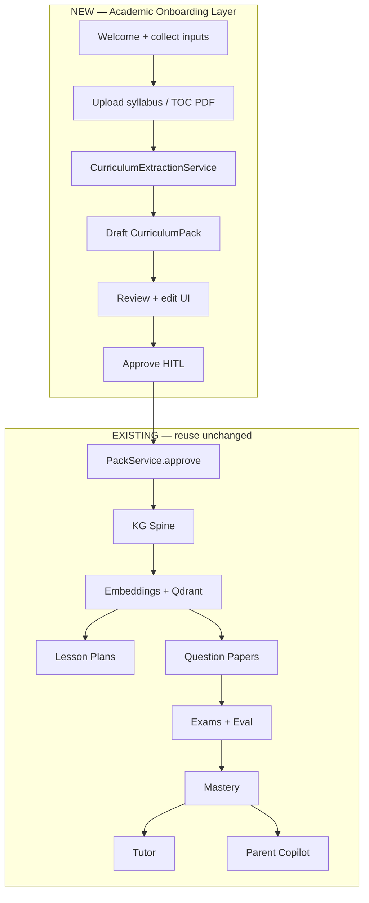
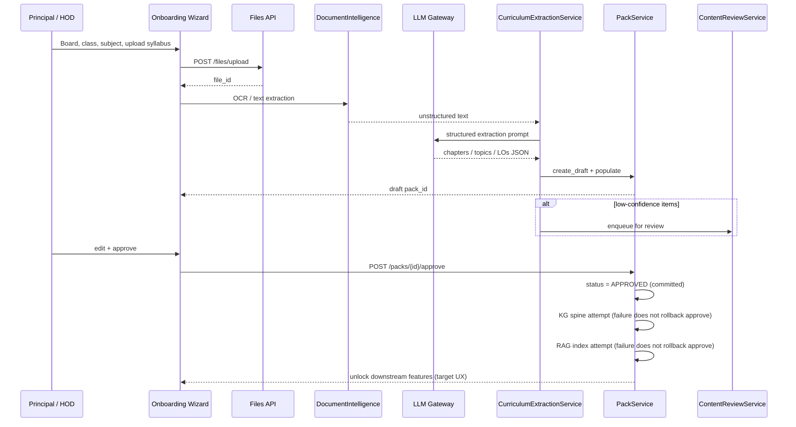
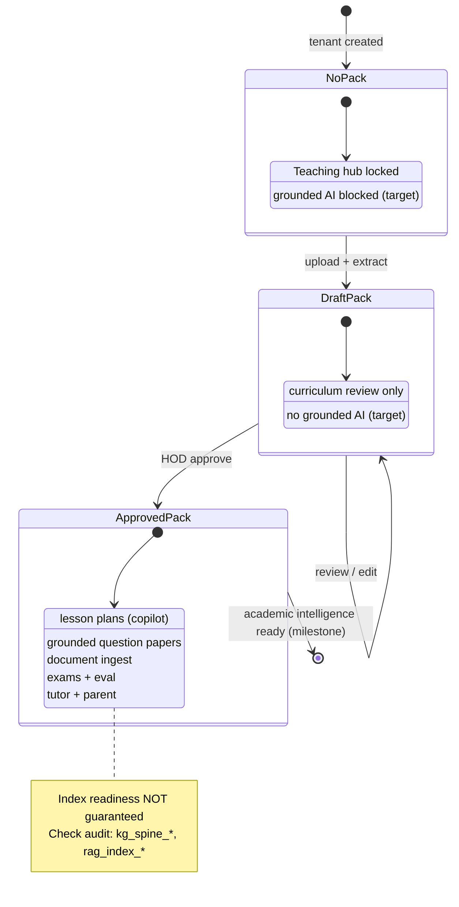
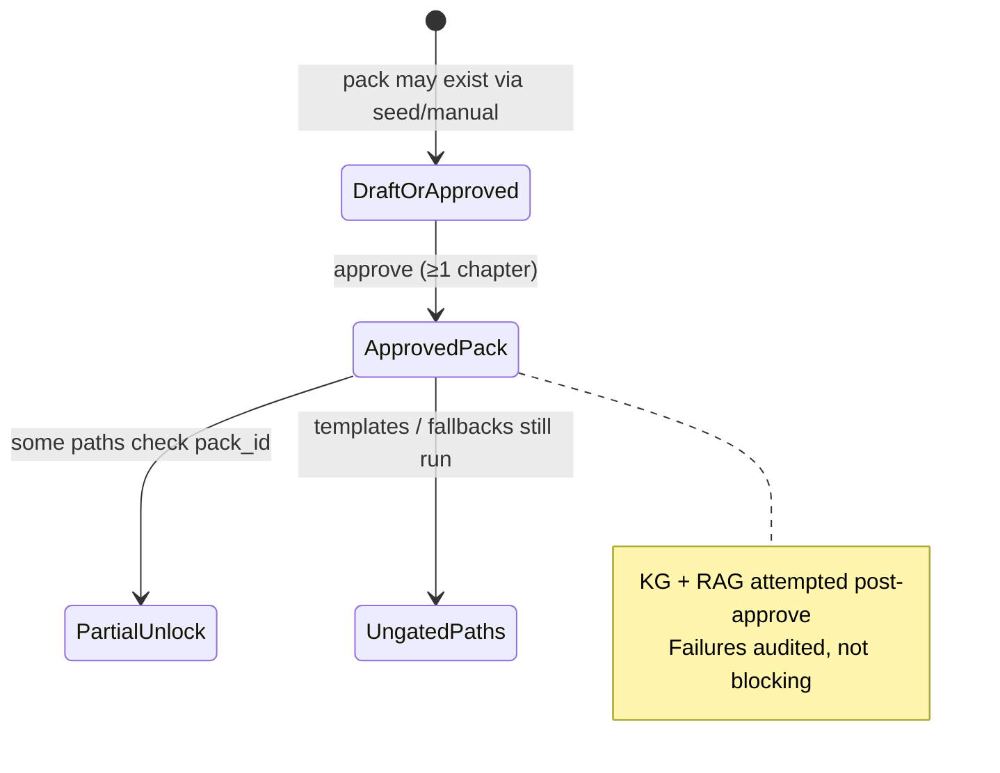
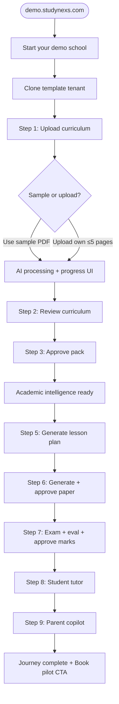
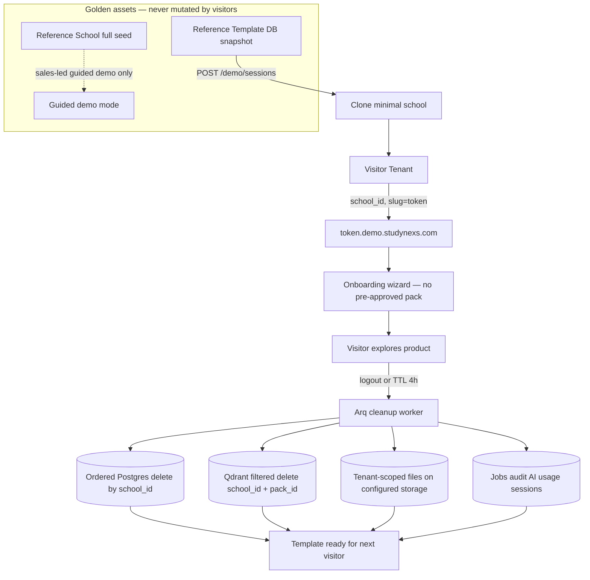
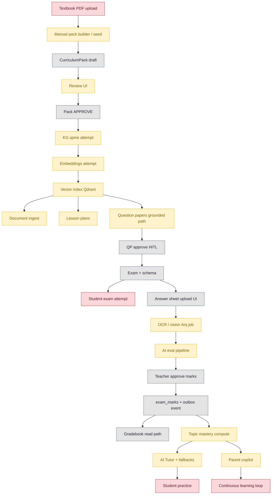
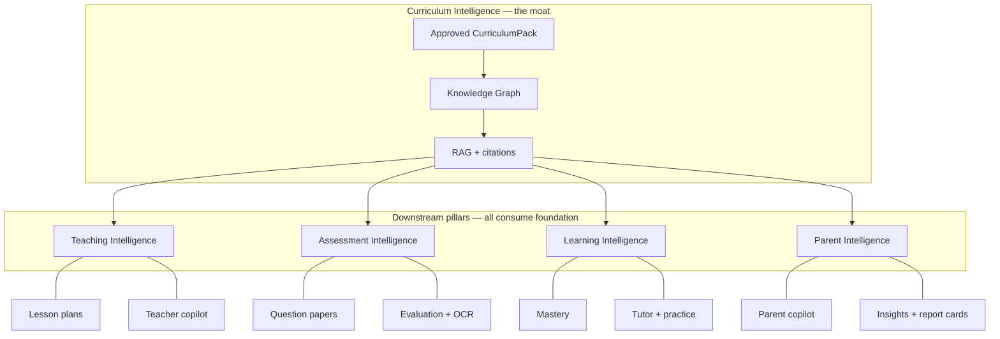
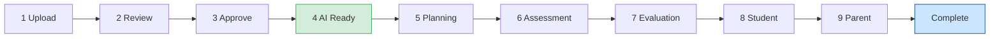

# StudyNexs Demo Experience & Academic Onboarding Gap Analysis

**Date:** 2026-07-22  
**Version:** 1.2 (validation pass — evidence separated, factual corrections applied)  
**Status:** **Strategic target architecture** — source-level validation complete; **live runtime validation blocked** (API unhealthy at time of review)  
**Audience:** Product leadership, sales, engineering  
**Perspective:** A school principal opening `https://demo.studynexs.com` for the first time  

**Related:**

- [`DEMO_V1_SCRIPT.md`](./DEMO_V1_SCRIPT.md) — current guided demo (seeded Reference School)
- [`DEMO_V1_JOURNEY_CHECKLIST.md`](./DEMO_V1_JOURNEY_CHECKLIST.md) — operator pre-flight
- [`AI_LEARNING_LOOP_VERIFICATION.md`](./AI_LEARNING_LOOP_VERIFICATION.md) — downstream engine audit
- [`PILOT_CLOSURE_BACKLOG.md`](./PILOT_CLOSURE_BACKLOG.md) — chain-integrity fixes

---

## Document status and evidence taxonomy

This document mixes four kinds of content. **Do not treat them interchangeably** when using it as an engineering or sales baseline.

| Layer | Meaning | How to read claims |
|-------|---------|-------------------|
| **Strategic target** | Recommended future architecture and product story | Aspirational — drives roadmap |
| **Source-level capability** | Code paths, models, endpoints, services exist in repo | Confirmed by static analysis; not proof of live behaviour |
| **Historical runtime evidence** | Past smoke/test runs when API was healthy | May be stale — cite date and conditions |
| **Current runtime evidence** | Live verification at time of review | **Blocked/unverified** if API `/health` and `/ready` fail |

### Validation verdict (2026-07-22)

**Strategically strong, not factually publish-ready without the corrections below.**

The central conclusion is **confirmed by source-level review**:

> StudyNexs has downstream academic-intelligence foundations, but lacks the curriculum-first onboarding experience that makes the product story credible.

**Current runtime state at validation:**

| Check | Result |
|-------|--------|
| Frontend (admin-web) | HTTP 200 |
| API `/health` | HTTP 500 |
| API `/ready` | HTTP 500 |

Therefore:

- Do **not** describe the current guided demo as runtime-ready.
- Do **not** cite `smoke_demo_readiness.py` 32/32 as *present* evidence without a fresh green run.
- Mark downstream live AI, vector, OCR, and integration behaviour as **unverified until API recovery**.

### Confirmed (source-level)

| Claim | Validation |
|-------|------------|
| Shared Reference School is seeded, not visitor-created | Confirmed |
| No self-service “Create Demo School” flow | Confirmed |
| No tenant clone, expiry, or cleanup service | Confirmed |
| Textbook/syllabus upload does **not** generate a structured Curriculum Pack | Confirmed |
| Document Intelligence requires an **approved** pack; adds indexed document chunks | Confirmed |
| Manual Curriculum Pack create, review, approve exist | Confirmed |
| Approval **attempts** KG spine + RAG indexing (after status flip) | Confirmed |
| No student exam-attempt UI | Confirmed |
| Student Tutor and Parent Copilot have partial/fallback paths | Confirmed |
| Parent portal has no report-card delivery surface | Confirmed |
| Frontend defaults to tenant `test`; Reference School uses `reference` | Confirmed (`NEXT_PUBLIC_TENANT_SLUG \|\| "test"`) |
| `School` model has no demo-expiry / provisioning lifecycle | Confirmed |
| Existing `school_id` scoping is the right foundation for disposable demo tenants | Confirmed |

### Partially confirmed (word carefully)

| Claim | Correction |
|-------|------------|
| “Approval triggers KG spine + RAG index” | Correct — but **KG/RAG failures do not block approval**. Pack status becomes `APPROVED` first; spine/index failures are audited (`kg_spine_failed`, `rag_index_*`). An approved pack may still have incomplete graph or index work. |
| “All downstream AI depends on the approved pack” | **Target vision**, not current enforcement. Lesson-plan **templates** and free-text question papers can run without a pack; Tutor has demo fallbacks. |
| “Grounded question papers and lesson plans work” | Grounded **code paths** exist; live provider + vector runtime **unverified** while API unhealthy. |
| “Mastery → Tutor → Parent chain works” | Services exist when topic-tagged marks and processing prerequisites are met. Reference seed also creates **independent** Tutor/misconception data — do not imply one live assessment produced all outcomes shown. |
| “OCR + evaluation exists” | Code path exists. Fresh image evaluation needs configured vision provider + **separate Arq worker** for async jobs. |
| `ContentReviewService` supports extraction review | Supports review records (incl. document-ingest). **Not yet** a curriculum-extraction review pipeline. |

### Factual corrections applied in v1.2

| Original claim | Correction |
|----------------|------------|
| “32/32 green” as current runtime | **Historical** only unless re-run with healthy API |
| `GET /lesson-plans/next` as proven defect | Endpoint exists; frontend calls it and **silently ignores errors**. Cannot isolate as defect while entire API returns 500 — **unverified pending API recovery** |
| Diagram 7 as “runtime dependency graph” | Renamed **Diagram 7 — Source-level capability and integration status**; colours reflect code/integration maturity, not live health |
| “Postgres cascade by school_id” | **Incorrect** — most FKs to `schools.id` do **not** use `ON DELETE CASCADE`. Cleanup requires explicit ordered deletion or future migration |
| “Qdrant namespace purge” | **Incorrect** — shared collections with payload filters (`school_id`, `pack_id`). Cleanup = filtered delete across collections |
| “Azure blob purge” | **Misleading for current dev** — uploads use local disk under school-scoped paths by default; Azure optional in `file_service`. Cleanup = tenant-scoped file deletion from configured storage |
| Mastery “requires Arq worker” | **Partially wrong** — marks→mastery uses **embedded outbox worker** in API lifespan when `OUTBOX_WORKER_ENABLED=True`. **Arq** is required for answer-sheet evaluation jobs |

---

## Executive summary

**StudyNexs has built the engine of an AI-first school operating system, but the front door still opens into someone else's already-built school.**

A principal who logs in today sees a finished dashboard and an approved curriculum pack they did not create. They never experience the moment that defines StudyNexs: *"I taught the platform my school's academic model — and now everything else makes sense."*

That is a **product story failure**, not a feature failure.

**Strategic call:** Stop optimizing the guided demo script. Start building the **academic onboarding layer** on top of existing CurriculumPack, KG, RAG, and AI services — do not fork or duplicate them.

**Operational note:** A **healthy API** is a prerequisite for any runtime demo claim. At validation time `/health` and `/ready` returned HTTP 500 — treat all live-demo readiness as **blocked** until recovered and re-smoked.

**The one sentence for the board:** StudyNexs wins when the first screen asks for a syllabus, not when the first screen shows a dashboard.

---

## Architecture diagrams (overview)

Diagrams 1–6 and 9 describe **strategic target architecture**. Diagram 7 reflects **source-level capability** (not live runtime health). Diagram 8 reflects **target pillar dependency** (not current enforcement). Sections 1–5 expand each area in prose.

### Diagram 1 — Product narrative: current vs target

### Diagram 2 — Academic onboarding: new layer on existing foundation

### Diagram 3 — Onboarding orchestrator (internal sequence)

### Diagram 4 — Approval unlock gates (target product-visible model)

*Target UX — not fully enforced in code today (see Partially confirmed above).*

### Diagram 4b — Approval unlock gates (current code — simplified)

### Diagram 5 — Self-guided demo experience flow

### Diagram 6 — Demo tenant lifecycle (template clone + TTL)

*Cleanup notes:* No automatic FK cascade today. Qdrant uses shared collections with payload filters, not per-tenant namespaces. File storage is local disk by default in dev (`UPLOAD_DIR / school_id`); production may use Azure — cleanup must follow configured backend.

### Diagram 7 — Source-level capability and integration status

**Not a live runtime graph.** Legend reflects **code + integration maturity** from source review. Live behaviour unverified while API unhealthy. Externally dependent nodes (vector, OCR, LLM) should be treated as **amber until re-smoked**.

| Colour | Meaning |
|--------|---------|
| Grey (`src`) | Source exists; integration path present |
| Amber | Partial, env-dependent, fallback, or chain-conditional |
| Red | Missing product surface or onboarding gap |

### Diagram 8 — Intelligence pillars (target dependency on approved pack)

*Target architecture — today some paths bypass full pack grounding (templates, fallbacks).*

### Diagram 9 — Demo journey stepper (UI progress model)

---

## 1. Product Journey Review

### What the product should say

See **Diagram 1** (target column). The first act is **Academic Onboarding** — upload, AI draft, human approve, intelligence unlocks. Everything downstream is a consequence of that approval.

### What the product actually says today

See **Diagram 1** (current column). The UI communicates **School ERP first, AI bolt-on second**. Curriculum is buried under Teaching. There is no "Welcome — let's learn your school" moment. The demo banner warns about sample data but does not guide the user through creating their own.

### Principal mental model vs product reality

| Principal expects | Product delivers today |
|-------------------|------------------------|
| "I upload my textbook/syllabus" | Manual pack builder or invisible seed scripts |
| "AI extracts my chapters and topics" | Document ingest only **extends** an approved pack (OCR + chunks, no structure extraction) |
| "I review once and approve" | Approve works — but only after manual/seeded data exists |
| "Then AI papers, lessons, tutor make sense" | Downstream AI works when pack exists — but **no visible unlock** |
| "This is my school's tenant" | Shared `reference` tenant with 288 pre-seeded students |
| "What do I click next?" | Feature navigation — no journey |

### Verdict

The **vision is correct and partially implemented at the engine layer**. The **product narrative is inverted**: demo starts at Act 3 (teaching/assessment) instead of Act 1 (academic onboarding).

---

## 2. Customer Journey Review

### Target journey (complete product)

See **Diagram 7** (source-level path) and **Diagram 8** (target pillar dependency).

### Current journey (source-level + last known runtime)

*Runtime column reflects last verified session when API was healthy (2026-07-21) plus source review. **Re-verify after API recovery.***

| Stage | Source | Last runtime / notes | Principal experience |
|-------|--------|----------------------|----------------------|
| School onboarding | Missing | — | No "Create demo school" — tenant exists via scripts |
| Academic onboarding | Missing journey | — | Curriculum page = admin CRUD, not onboarding |
| Upload → generate curriculum | Missing | — | No extraction pipeline; seeds hardcode chapters |
| Review curriculum | Partial | UI loads when API up | Jargon-heavy; no wizard |
| Approve curriculum | Implemented | Approve succeeds; KG/RAG **attempted** | Audit may show index failures |
| Teaching intelligence | Partial | Lesson-plan `/next` **unverified** (API 500) | Frontend silently ignores load errors |
| Assessment intelligence | Partial | Grounded paths exist; live LLM unverified | QP + HITL in code; seed-dependent demo |
| Student exam attempt | Missing | — | No student exam UI |
| Evaluation (OCR + AI) | Partial | Seeded eval + code path | Fresh OCR needs vision provider + **Arq worker** |
| Teacher approval → marks | Implemented | Works when API up | Must click Approve |
| Mastery → Tutor | Partial | Chain conditional; seed creates parallel tutor data | Do not imply one assessment → tutor |
| Parent insights | Partial | Copilot path exists | No report cards on parent portal |
| Student practice | Missing | — | Recommendations only |
| Continuous learning | Missing | — | Not productized |

### Where trust breaks for a first-time principal

1. **"Whose school is this?"** — Shared tenant, not theirs
2. **"Did AI really learn our curriculum?"** — They didn't upload anything
3. **"Why should I trust these question papers?"** — Grounding badge exists but provenance wasn't earned in-session
4. **"Can my teachers use this Monday?"** — No sense of how *their* school gets to this state

---

## 3. Academic Onboarding Architecture

**Principle:** Build one onboarding layer on top of existing foundations. Do not fork CurriculumPack, RAG, KG, or AI services.

### Existing foundation (reuse as-is)

| Component | Role | Notes |
|-----------|------|-------|
| `PackService` | Draft → approve → immutable + audit | Approve commits status **before** KG/RAG attempts |
| `pack_service.approve` | KG spine + eager RAG index **attempts** | Failures audited; do not block approval |
| `DocumentIntelligenceService` | OCR → chunk → embed → index | Requires **approved** pack |
| `ContentReviewService` | HITL queue | Document-ingest review today; **not** curriculum-extraction pipeline yet |
| `ConceptCardService` | Tutor grounding assets | |
| `assessment_grounding` | QP/eval grounding when pack linked | Not all QP paths require pack |
| `teacher_copilot` | Grounded when pack provided | |
| `lesson_plan_service` | Template (no pack) + copilot (pack) | Two modes — only copilot is fully grounded |
| Files upload | `POST /api/v1/files/upload` | Local disk default; Azure optional |
| Admissions OCR pattern | Upload + extract UI | Reuse pattern for onboarding wizard |

### Missing seam (one new layer, not a parallel stack)

See **Diagram 2** (layered architecture), **Diagram 3** (orchestrator sequence), and **Diagram 4** (unlock gates).

| Step | Action |
|------|--------|
| 1 | Collect: board, class, subject, textbook meta, syllabus PDF/TOC, optional blueprint |
| 2 | DocumentIntelligence: OCR/text from uploads |
| 3 | **NEW** `CurriculumExtractionService` (LLM via gateway): text → draft `PackDetail` → Pydantic validate |
| 4 | `PackService.create_draft` + populate chapters/topics |
| 5 | `ContentReviewService.enqueue` for low-confidence items | **Extend** — new item type for extraction review |
| 6 | Review UI → human edits → `PackService.approve` |
| 7 | Emit onboarding events → unlock downstream nav/features |

### Recommended onboarding inputs (`PRODUCT.md` §6.3)

| Input | Required? | Reuse |
|-------|-----------|-------|
| Board | Yes | School profile |
| Class + subject | Yes | Academic module |
| Textbook name/edition | Yes | Pack metadata |
| Syllabus PDF or chapter list | Yes (one of) | Files + DocumentIntelligence |
| Term-wise scope | Optional | Pack metadata JSONB |
| Exam blueprint | Optional | Existing blueprint seed pattern |
| Sample previous paper | Optional | QP bank seeding later |

### Approval unlock model

**Today (code):** Partial — some services check `PackStatus.APPROVED`; templates and fallbacks still run. Approval does **not** guarantee index readiness — check audit events (`kg_spine_succeeded` / `kg_spine_failed`, `rag_index_*`).

**Target (product):** Explicit unlock UX — see **Diagram 4** (target) vs **Diagram 4b** (current):

| Before approve (target) | After approve (target) |
|-------------------------|------------------------|
| Curriculum review only | Grounded lesson plans, AI papers, document ingest |
| "Academic intelligence preparing…" | "Academic intelligence ready" **only when audit confirms index** |
| Teaching hub tabs greyed / explained | Full teaching, assessment, learning surfaces |
| Ungrounded paths disabled in demo | All AI calls show pack provenance |

**Implementation:** Feature gate map keyed off `onboarding_state` + **index readiness** from pack audit — not new AI stacks.

---

## 4. Demo Experience Architecture

### Target: self-guided principal demo

**Entry:** `https://demo.studynexs.com` — no credentials emailed, no presenter.

See **Diagram 5** (self-guided flow) and **Diagram 9** (stepper UI).

### Current demo experience gaps

| Requirement | Today |
|-------------|-------|
| Zero presenter | Requires 45–60 min guided script |
| Starts without seeded curriculum | Starts at approved pack |
| "What should I click next?" | Feature nav only |
| Progress indicators | Admissions pipeline has pattern; curriculum has audit timeline only |
| Contextual explanations | Demo banner only |
| Automatic navigation | None |
| Success/completion | None |
| Grounding earned in-session | Pre-seeded data |

### Recommended demo UX components (reuse-first)

| Component | Reuse from | Purpose |
|-----------|------------|---------|
| `DemoJourneyStepper` | Admissions stage UI | 9-step progress rail |
| `OnboardingWizard` | StaffOnboardModal + Appendix K wizard | Academic onboarding steps |
| `ProcessingState` | Answer-sheet eval async polling | "AI analysing your syllabus…" |
| `UnlockCelebration` | `sn-success-pulse` | Post-approve moment |
| `ContextualCoachmarks` | Thin layer on existing pages | "Next: generate a paper from *your* pack" |
| `DemoCompletionScreen` | Marketing CTA pattern | End of journey |

### Demo content strategy

Two paths for self-guided reliability:

1. **Quick path (default):** Pre-loaded sample syllabus PDF (2-page TOC) — "Use sample"
2. **Upload path:** Visitor uploads own TOC/syllabus (≤5 pages for v1)

Both hit the same review → approve → unlock flow.

### Demo narrative the principal must feel

> *"I uploaded our syllabus. StudyNexs understood our chapters. I approved it once. Now every AI feature knows our school — and my teachers still control what gets published."*

---

## 5. Demo Tenant Architecture

### Why shared `reference` tenant fails long-term

| Problem | Impact |
|---------|--------|
| Visitor A approves; Visitor B sees it | Breaks "my school" illusion |
| Concurrent demos corrupt data | Untrustworthy demo |
| Cannot reset without affecting others | Operator dependency |
| Principal finishes with someone else's students | Wrong emotional outcome |

**Reference School remains** as a **golden template**, not the visitor runtime.

### Options evaluated

| Approach | Pros | Cons | Verdict |
|----------|------|------|---------|
| **A. Disposable tenant (recommended)** | Matches `school_id` isolation; no schema fork | Clone logic must be built | **Best** |
| **B. DB snapshot restore** | True pristine state | Slow, costly, heavy ops | Overkill for v1 |
| **C. Temporary schema per visitor** | Strong isolation | Breaks monolith assumptions | **Reject** |
| **D. Row-level demo_session_id** | Fast to hack | Leak risk; not truly isolated | **Reject** |
| **E. `{token}.demo.studynexs.com`** | Clean URL; natural tenant resolution | Needs provisioning + DNS | **Best UX** |

### Recommended: Template Clone + TTL Expiry

See **Diagram 6** (tenant lifecycle).

**Provisioning:**

1. `POST /api/v1/demo/sessions` (public, rate-limited, Turnstile) → `{ session_token, tenant_slug, expires_at }`
2. Magic-link or auto principal auth (no emailed password for PLG)
3. Redirect to onboarding wizard — **not dashboard**
4. On expiry → enqueue cleanup

**Reference template:** Minimum viable school (1 class, 1 subject, 2 teachers, 1 student, 1 parent, **no approved pack**). Full Reference School seed stays for **sales-led guided demos** only.

**Clone complexity (under-estimated in v1.0):** A full tenant clone is harder than copying a `school` row. Every school-scoped record, FK relationship, file path, Qdrant payload, job row, audit entry, and session must be **remapped or omitted**. Prefer **minimal template + empty academic state** over deep clone of Reference School.

### Background workers (two models)

| Worker | Purpose | When required |
|--------|---------|---------------|
| **Embedded outbox worker** | `exam_marks` events → mastery recompute | API lifespan when `OUTBOX_WORKER_ENABLED=True` (default) |
| **Arq worker** | Answer-sheet evaluation, heavy async jobs | Separate process for live OCR/eval upload demo |

Do not conflate these when describing the marks → mastery chain.

---

## 6. Source-level gap analysis

Visual summary: **Diagram 7** (capability/integration maturity — **not** live runtime health).

| Stage | Implemented | Partial | Missing | Reusable | Redesign |
|-------|:-----------:|:-------:|:-------:|:--------:|:--------:|
| Create demo school | | | ✓ | Seed as clone template | Provisioning API |
| Upload textbook/syllabus | | ✓ | ✓ | DocumentIntelligence | Ingest order inverted |
| AI analyse → extract structure | | ✓ OCR | ✓ | LLM gateway | New extraction service |
| Build draft Curriculum Pack | ✓ manual | | | PackService, UI | Wrap in wizard |
| Review + approve pack | ✓ | ✓ UX | | approve pipeline | Unlock + index readiness UX |
| KG + embeddings + vector | ✓ attempt | ✓ fail-soft | | pack_service, Qdrant | Index readiness gate |
| Lesson plans | ✓ API | ✓ templates ungated | | lesson_plan_service | Runtime unverified |
| Question papers + HITL | ✓ | ✓ free-text path | | QP service | Gate on onboarding |
| Exam | ✓ | | | exam service | Student attempt missing |
| Answer sheet + OCR + eval | ✓ | ✓ | | eval service, **Arq** | Demo sample sheet |
| Teacher approve marks | ✓ | | | evaluate UI | Stepper-visible |
| Gradebook / mastery | ✓ | ✓ chain | | outbox + mastery | Topic alignment |
| AI tutor | ✓ | ✓ fallback | | tutor module | Kill demo fallback |
| Student practice | | | ✓ | question bank | Thin MCQ slice |
| Parent copilot | ✓ | ✓ | | parent API | Portal RC surface |
| Continuous learning | | | ✓ | outbox pattern | Future |

---

## 7. Demo Progress Stepper (recommended)

See **Diagram 9**. Reuse admissions pipeline stage-counter pattern. Stepper persists across role switches (principal → teacher → student → parent) within one demo session.

| Step | Label | Unlock condition |
|------|-------|------------------|
| 1 | Upload Curriculum | Tenant provisioned |
| 2 | Review Curriculum | Extraction complete |
| 3 | Approve Curriculum | Draft pack exists |
| 4 | Academic Intelligence Ready | Pack approved **and** audit shows index success (or retry offered) |
| 5 | Teacher Planning | Step 4 complete |
| 6 | Assessment | Step 4 complete |
| 7 | Evaluation | Exam + eval seeded or created |
| 8 | Student Learning | Marks approved |
| 9 | Parent Insights | Mastery / tutor data present |
| — | Complete | All steps checked |

---

## 8. UX Improvements

### Intelligence pillars — communication today

| Pillar | Communicated? | Recommendation |
|--------|---------------|----------------|
| Academic Onboarding | No | First-run wizard; "Teach StudyNexs your curriculum" |
| Teaching Intelligence | Scattered | Post-unlock hub + pack provenance on every AI output |
| Assessment Intelligence | Partial | Pack citation on every generated question |
| Learning Intelligence | Partial | Visible link: exam result → tutor lesson |
| Parent Intelligence | Partial | "Same approved curriculum and marks" messaging |

### Principal should never see (self-guided mode)

- Empty dashboard with no guidance
- Pre-approved curriculum they didn't create
- API errors with no recovery path (verify `/health` before demo)
- AI features without visible curriculum grounding
- Shared students from another visitor's session
- Reference seed outcomes presented as proof of a single live assessment chain

---

## 8b. Additional risks (missing from v1.0)

| Risk | Impact | Mitigation |
|------|--------|------------|
| **Approval ≠ index readiness** | "Academic intelligence ready" shown while RAG/KG failed | Gate milestone on audit success; offer retry index; surface failures in onboarding UI |
| **Incomplete tenant cleanup** | PII/cost leakage across demo sessions | Ordered delete: jobs → vectors (filtered) → files → domain rows → school; not single-row cascade |
| **Public upload abuse** | Cost, malware, storage exhaustion | Size limits (existing 1 MB on ingest UI), rate limits, Turnstile, MIME validation, LLM cost caps, retention notice, optional virus scan |
| **Tenant clone underestimation** | Broken FKs, duplicate slugs, orphan vectors | Minimal empty template; explicit ID remapping table; integration tests per clone |
| **Reference seed ≠ live chain proof** | Over-claiming Tutor/Parent personalization | Demo copy: "representative outcomes"; stepper must distinguish seeded vs visitor-generated |
| **Default tenant mismatch** | Operator hits `test` while docs say `reference` | Document `NEXT_PUBLIC_TENANT_SLUG=reference`; fail fast in demo mode if wrong tenant |
| **API unhealthy blocks all verification** | False confidence or false defects | Recovery + fresh smoke before sales baseline; separate source vs runtime sections |
| **Ungrounded AI paths undermine story** | Principal sees AI without pack | Disable template/free-text paths in demo mode; enforce pack_id in showcase |

---

## 9. Engineering Improvements (by customer impact)

### P0 — Blocks the moat story

| Item | Reuse | Effort |
|------|-------|--------|
| **Restore API health + re-run smoke** | existing scripts | **S** (ops) |
| Academic Onboarding Wizard UI | curriculum page, admissions wizard | **L** |
| CurriculumExtractionService | gateway, DocumentIntelligence, PackService | **L** |
| Demo session provisioning API | tenant middleware, minimal template | **L** |
| Onboarding unlock gates + index readiness | pack audit events | **M** |
| Ordered tenant cleanup service | school_id scoping | **M** |

*Removed from P0:* "Fix `/lesson-plans/next` 500" — not proven isolated; reproduce only after API recovery with endpoint-specific stack trace.

### P1 — Self-guided demo reliability

| Item | Effort |
|------|--------|
| Demo Journey Stepper | **M** |
| Sample syllabus + "Use sample" path | **S** |
| Async extraction job + progress polling | **M** |
| Tenant TTL cleanup worker | **M** |
| Qdrant filtered delete by `school_id` | **M** |
| Public demo auth (magic link) | **M** |
| Kill tutor demo fallback in demo env | **S** |
| Stepper forces eval approve before tutor segment | **S** |

### P2 — Complete journey honesty

| Item | Effort |
|------|--------|
| Student practice thin slice (5 MCQ from bank) | **L** |
| Parent report card on portal | **M** |
| Student exam surface OR explicit offline-exam stepper copy | **L** / **S** |
| Topic title normalization (mastery chain) | **M** |

---

## 10. Prioritized Implementation Roadmap

### Phase 0 — Demo honesty (2–3 weeks)

- **Restore API health**; re-run `smoke_demo_readiness.py` and record date/count
- Kill tutor demo fallback in showcase environments
- Demo stepper for guided demo (replaces presenter script dependency)
- Ship Gate 1 dashboard truth fixes
- Document guided vs self-guided modes; separate source vs runtime claims
- If lesson-plan load fails **after** API recovery: reproduce `/lesson-plans/next` with stack trace before prioritizing fix

**Outcome:** Guided demo can be **runtime-validated** again; curriculum-first story even with seeded data.

### Phase 1 — Academic onboarding MVP (6–8 weeks)

- CurriculumExtractionService (sample TOC → draft pack)
- Onboarding wizard (welcome → upload → processing → review → approve)
- Unlock gates on teaching/AI surfaces
- Post-approve redirect: "Generate your first question paper"

**Outcome:** Principal experiences "I taught StudyNexs my curriculum" on single tenant (interim).

### Phase 2 — Isolated demo tenants (4–6 weeks)

- Template clone provisioning
- `{token}.demo.studynexs.com` routing
- TTL cleanup worker
- Public landing + magic-link auth
- Sample syllabus default path

**Outcome:** `demo.studynexs.com` works without presenter; fresh school per visitor.

### Phase 3 — Complete journey (6–10 weeks)

- Assessment stepper: paper → exam → eval → approve marks
- Tutor connected to visitor's eval (no fallback)
- Parent copilot reflects session marks
- Student practice thin slice
- Journey completion screen + CRM handoff

**Outcome:** Principal finishes understanding full OS.

### Phase 4 — Production onboarding (parallel)

- White-glove import for paying schools
- Multi-subject / multi-grade
- Blueprint editor
- Annual rollover wizard

---

## 11. Public Demo Readiness Report

*Readiness as of validation — API unhealthy. Re-score after recovery + fresh smoke.*

| Mode | Readiness | Risks | Missing work | Effort |
|------|-----------|-------|--------------|--------|
| **Live guided demo** | **Blocked** (API 500) / historically viable with presenter | API down; tutor fallback; shared tenant; wrong default tenant | Phase 0 recovery + smoke | **S** after ops fix |
| **Self-guided demo** | Not ready | No onboarding; seeded start; shared tenant | Phase 1 + 2 | **L** (10–14 wk) |
| **Public evaluation env** | Not ready | No provisioning; no isolation; upload abuse; LLM cost | Phase 2 + infra + abuse controls | **L** (12–16 wk) |
| **Product-led onboarding** | Not ready | No PLG auth; empty onboarding docs | Phase 2 + 3 | **XL** (16–24 wk) |

### Historical runtime evidence (not current)

On **2026-07-21** with healthy API, `smoke_demo_readiness.py` reported **32/32** on tenant `reference`. That run is **historical evidence only** until repeated.

### Success criterion

> A principal receives a URL and completes the journey without assistance.

| When | Status |
|------|--------|
| Today | Fails at step 0 |
| After Phase 2 | Partial — curriculum onboarding works |
| After Phase 3 | Target met for bounded demo (1 class, 1 subject) |

---

## 12. Final Recommendation

### Do first (next 90 days)

1. **Restore API + re-smoke** — establish current runtime baseline
2. **Academic Onboarding Wizard** — upload sample syllabus → AI draft → review → approve → unlock (with index readiness)
3. **Demo Journey Stepper** — reuse admissions pipeline pattern
4. **Isolated demo tenant provisioning** — minimal template + TTL + **ordered cleanup**
5. **Demo-mode enforcement** — disable ungrounded AI paths in showcase; kill tutor fallback

*Deferred until proven after API recovery:* endpoint-specific lesson-plan defect

### Do not do

- Build a second curriculum system
- Fork RAG, KG, or QP services for demo
- Keep investing in richer Reference School seed as the primary demo path
- Launch public demo URL before tenant isolation exists
- Promise textbook warehousing — structured extraction + Concept Cards only

### Keep Reference School as

Golden template for sales engineering and regression — **separate from visitor tenants**. Guided enterprise demos may use fully-seeded Reference School until Phase 2 ships.

---

## Appendix A — Ideal self-guided demo script (target state)

*Not runnable today. For product/design.*

1. Open `https://demo.studynexs.com` → **"Start your demo school"**
2. Enter school name → auto-provision tenant → **Step 1: Upload curriculum**
3. Click **"Use sample syllabus"** (or upload ≤5 page PDF)
4. Progress: *Analysing → Extracting chapters → Building draft pack*
5. **Step 2: Review** — edit one topic → confirm LOs
6. **Step 3: Approve** → *"Academic intelligence ready"*
7. Auto-advance → **Generate lesson plan** (grounded badge visible)
8. **Generate question paper** → **Approve as incharge**
9. **Create exam** → upload sample answer sheet → **Approve AI marks**
10. **Gradebook** → mastery heatmap updates
11. **Student** → tutor recommends lesson from *your* exam
12. **Parent** → copilot summarises *your* child's performance
13. **Journey complete** → **Book a pilot**

Every step grounded in the pack approved in step 6. No presenter. No shared data.

---

## Appendix B — Current guided demo (interim)

Until Phase 1–2 ship, use [`DEMO_V1_SCRIPT.md`](./DEMO_V1_SCRIPT.md) with [`DEMO_V1_JOURNEY_CHECKLIST.md`](./DEMO_V1_JOURNEY_CHECKLIST.md).

**Do not start with textbook upload.** Start at principal dashboard → approved Class 10 Maths pack. Narrate: *"Your school is already onboarded — here's what StudyNexs constructed; here's how you'd extend it."*

**Do not start with textbook upload.** Start at principal dashboard → approved Class 10 Maths pack. Narrate: *"Your school is already onboarded — here's what StudyNexs constructed; here's how you'd extend it."*

**Do not claim** Reference seed Tutor/Parent outcomes prove a single live assessment chain.

**Critical live click (when API healthy):** Approve AI evaluation on Unit Test before student/parent segment.

**Pre-flight:** Verify `GET /health` and `/ready` return 200; set `NEXT_PUBLIC_TENANT_SLUG=reference` (not default `test`).

---

*Document version: 1.2 · 2026-07-22 · validation pass: evidence taxonomy, factual corrections, additional risks*
